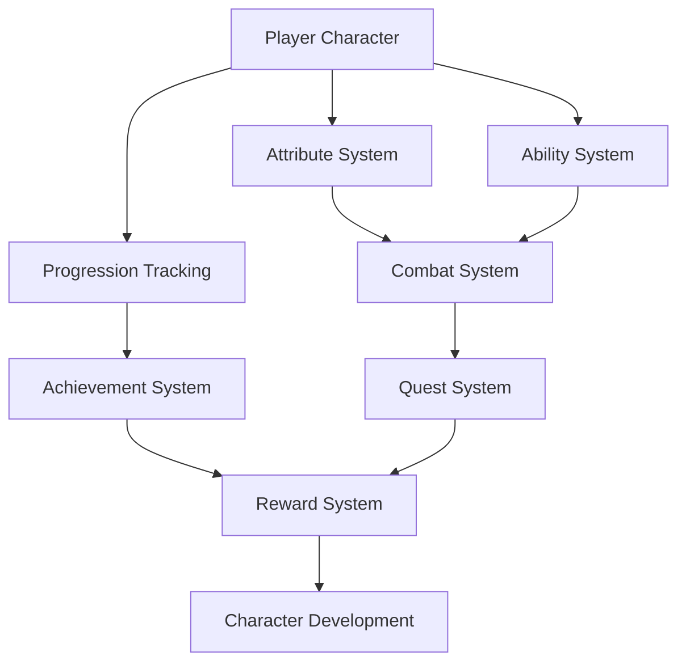

# Game Mechanics and Progression Systems Documentation

## Overview
This document details the core gameplay mechanics and progression systems in Elysian Nexus, including character development, abilities, and advancement systems.

## Table of Contents
1. [Character System](#character-system)
2. [Ability System](#ability-system)
3. [Progression System](#progression-system)
4. [Quest System](#quest-system)
5. [Achievement System](#achievement-system)
6. [Crafting System](#crafting-system)

## Character System
### Overview
The character system manages player attributes, skills, and development throughout the game.

### Core Components
- **Base Attributes**
  - Strength
  - Agility
  - Intelligence
  - Wisdom
  - Constitution
  - Charisma

### Derived Statistics
- Health Points
- Energy Points
- Mental Focus
- Physical Defense
- Magical Defense
- Critical Chance
- Dodge Rate

### Character Classes
- **Primary Classes**
  - Celestial Warrior
  - Void Mage
  - Reality Shaper
  - Time Weaver
  - Essence Binder
  - Chaos Agent
  - Order Knight

### Specializations
- Class-specific paths
- Hybrid combinations
- Faction influences
- Unique abilities
- Special traits

## Ability System
### Overview
Comprehensive system managing character abilities, spells, and special powers.

### Ability Types
- **Combat Abilities**
  - Physical attacks
  - Magical spells
  - Special techniques
  - Ultimate powers
  - Combo moves

### Ability Mechanics
- Cooldown system
- Resource costs
- Charge mechanics
- Combo system
- Status effects

### Progression
- Ability leveling
- New ability acquisition
- Ability modification
- Specialization options
- Cross-class abilities

## Progression System
### Overview
Manages character advancement, skill development, and power scaling.

### Experience System
- Level progression
- Skill experience
- Ability mastery
- Faction standing
- Achievement points

### Advancement Mechanics
- Level-up rewards
- Skill point allocation
- Ability unlocks
- Specialization choices
- Faction rewards

### Milestones
- Character achievements
- Story progression
- Faction advancement
- Skill mastery
- Special unlocks

## Quest System
### Overview
Dynamic quest system providing various types of missions and objectives.

### Quest Types
- **Main Quests**
  - Story missions
  - Character development
  - World-changing events
  - Faction storylines

### Side Quests
- Faction missions
- Character-specific
- World events
- Random encounters
- Daily challenges

### Quest Features
- Branching outcomes
- Multiple solutions
- Dynamic difficulty
- Reputation impact
- Reward scaling

## Achievement System
### Overview
Comprehensive system tracking player accomplishments and providing rewards.

### Achievement Categories
- **Story Achievements**
  - Plot milestones
  - Character development
  - World events
  - Special discoveries

### Gameplay Achievements
- Combat mastery
- Skill progression
- Exploration
- Collection
- Faction standing

### Reward System
- Unique items
- Special abilities
- Cosmetic rewards
- Stat bonuses
- Title unlocks

## Crafting System
### Overview
Complex crafting system allowing creation and modification of items.

### Crafting Types
- **Item Crafting**
  - Weapons
  - Armor
  - Consumables
  - Special items
  - Faction items

### Crafting Mechanics
- Resource gathering
- Recipe discovery
- Quality system
- Success chance
- Special effects

### Progression
- Crafting skill
- Recipe unlocks
- Quality improvements
- Special techniques
- Faction recipes

## Technical Implementation
### System Architecture

### Data Management
- Character state
- Progress tracking
- Achievement data
- Quest status
- Crafting data

### Performance Considerations
- State management
- Progress saving
- Achievement tracking
- Quest updating
- Crafting calculations

## Future Expansions
### Planned Features
- Advanced class system
- New ability types
- Extended progression
- Complex questing
- Achievement expansion

### System Improvements
- Enhanced crafting
- Better rewards
- More achievements
- Quest complexity
- Class balance