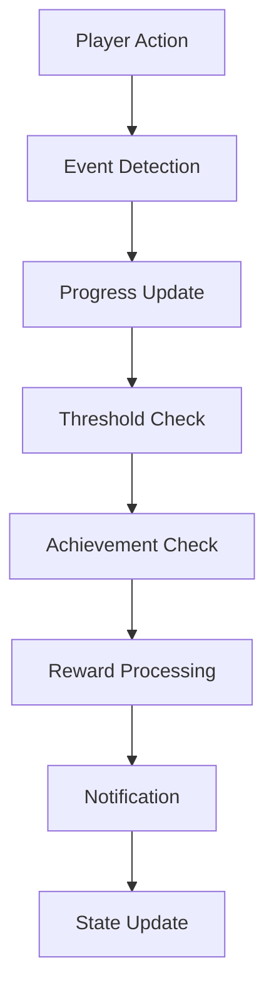
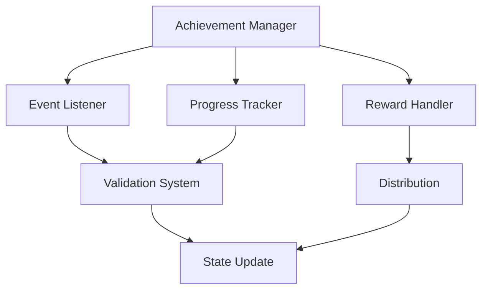

# Achievement System Documentation

## Overview
The Achievement system manages player accomplishments, milestones, and rewards, providing meaningful progression tracking, engagement incentives, and recognition of player achievements while maintaining balanced reward distribution.

## Core Systems

### Achievement Architecture
- **Achievement Types**
  - Progression Achievements
    - Story milestones
    - Character development
    - Skill mastery
    - Faction standing
    - World exploration
  
  - Challenge Achievements
    - Combat feats
    - Collection goals
    - Time trials
    - Special events
    - Hidden objectives

### Achievement Structure
```python
achievement_data = {
    'metadata': {
        'id': achievement_id,
        'category': achievement_type,
        'difficulty': challenge_level,
        'points': point_value,
        'hidden': is_hidden
    },
    'requirements': {
        'conditions': completion_conditions,
        'thresholds': progress_thresholds,
        'dependencies': prerequisite_list,
        'exclusions': mutual_exclusions,
        'timeframe': time_constraints
    },
    'rewards': {
        'items': reward_items,
        'currency': currency_rewards,
        'titles': unlocked_titles,
        'cosmetics': cosmetic_rewards,
        'abilities': special_abilities
    }
}
```

## Progress Tracking

### Tracking Pipeline


### Progress Types
- **Tracking Categories**
  - Numeric progress
  - State-based
  - Multi-condition
  - Time-based
  - Sequential

## Reward System

### Reward Types
- **Reward Categories**
  - Material rewards
  - Cosmetic rewards
  - Gameplay benefits
  - Social rewards
  - Meta rewards

### Distribution System
- **Distribution Methods**
  - Instant rewards
  - Milestone rewards
  - Cumulative rewards
  - Choice rewards
  - Progressive rewards

## Technical Implementation

### Achievement Pipeline


### Performance Systems
- **Optimization Methods**
  - Event filtering
  - Progress caching
  - Batch updates
  - State compression
  - Lazy loading

## Integration Points

### System Integration
- **Connected Systems**
  - Player system
  - Quest system
  - Combat system
  - Inventory system
  - Social system

### Event Handling
- **Event Types**
  - Progress events
  - Completion events
  - Reward events
  - Social events
  - System events

## UI/UX Features

### Interface Elements
- **UI Components**
  - Achievement list
  - Progress tracking
  - Reward display
  - Notifications
  - History log

### Notification System
- **Notification Types**
  - Progress updates
  - Completions
  - Rewards
  - Milestones
  - Special events

## Social Features

### Social Integration
- **Social Elements**
  - Leaderboards
  - Comparisons
  - Sharing
  - Cooperative goals
  - Community events

### Competition System
- **Competition Types**
  - Individual rankings
  - Guild rankings
  - Time-limited events
  - Special challenges
  - Server firsts

## Development Tools

### Debug Tools
- **Tool Types**
  - Achievement editor
  - Progress simulator
  - Reward tester
  - State inspector
  - Event logger

### Testing Framework
- **Test Categories**
  - Progress tests
  - Reward tests
  - Integration tests
  - Performance tests
  - UI/UX tests

## Technical Considerations

### Performance Optimization
- **Optimization Areas**
  - Event processing
  - Progress tracking
  - State management
  - Reward distribution
  - UI updates

### Data Management
- **Management Types**
  - Progress data
  - Reward history
  - State persistence
  - Statistics tracking
  - Analytics data

## Error Handling

### Error Types
- **Error Categories**
  - Progress errors
  - Reward errors
  - State errors
  - Validation errors
  - Integration errors

### Recovery Procedures
- **Recovery Steps**
  - Error detection
  - Progress validation
  - State recovery
  - Reward verification
  - Data restoration

## Future Expansions

### Planned Features
- **Enhancements**
  - Dynamic achievements
  - Advanced tracking
  - Better rewards
  - Social features
  - Analytics tools

### System Improvements
- **Updates**
  - Better performance
  - More flexibility
  - Enhanced UI/UX
  - Improved tracking
  - Better integration 