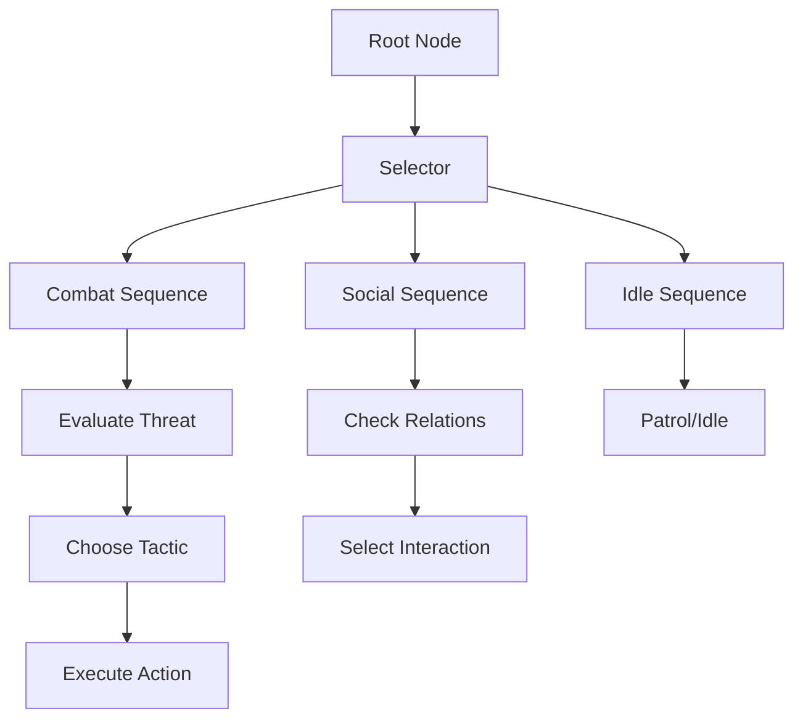
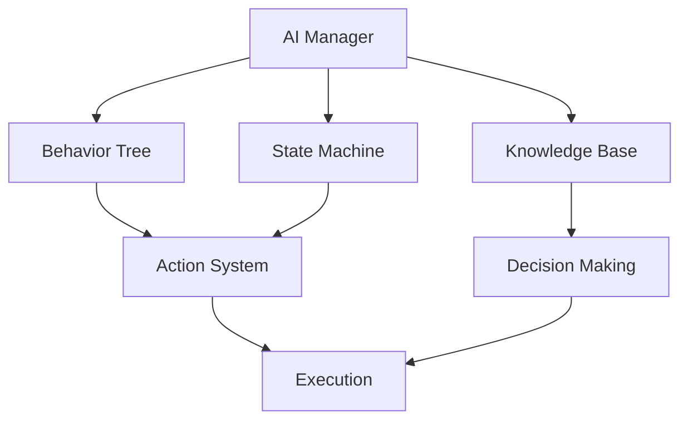

# AI Behavior System Documentation

## Overview
The AI Behavior system manages all artificial intelligence aspects of the game, handling decision-making, pathfinding, combat tactics, and dynamic behavior patterns while maintaining believable and engaging NPC interactions.

## Core Systems

### AI Architecture
- **Behavior Types**
  - Strategic Behaviors
    - Combat tactics
    - Resource management
    - Group coordination
    - Territory control
    - Objective planning
  
  - Social Behaviors
    - NPC interactions
    - Faction relations
    - Emotional states
    - Memory systems
    - Personality traits

### AI Structure
```python
ai_data = {
    'entity': {
        'id': entity_id,
        'type': ai_type,
        'role': entity_role,
        'faction': faction_id,
        'personality': personality_traits
    },
    'state': {
        'current_goal': active_goal,
        'behavior_state': current_state,
        'knowledge': knowledge_base,
        'memory': memory_data,
        'emotions': emotional_state
    },
    'tactics': {
        'combat_style': combat_preferences,
        'skill_usage': ability_priorities,
        'target_selection': targeting_rules,
        'positioning': position_strategy,
        'cooperation': group_tactics
    }
}
```

## Decision Making

### Behavior Tree


### Intelligence Types
- **AI Categories**
  - Combat AI
  - Social AI
  - Economic AI
  - Strategic AI
  - Environmental AI

## Combat System

### Combat Behaviors
- **Behavior Types**
  - Aggressive
  - Defensive
  - Supportive
  - Evasive
  - Tactical

### Combat Tactics
- **Tactical Elements**
  - Target selection
  - Skill rotation
  - Positioning
  - Resource management
  - Team coordination

## Technical Implementation

### AI Pipeline


### Performance Systems
- **Optimization Methods**
  - Decision caching
  - LOD AI
  - Batch processing
  - Priority scheduling
  - Resource pooling

## Integration Points

### System Integration
- **Connected Systems**
  - Combat system
  - Navigation system
  - Animation system
  - Faction system
  - World state

### Event Handling
- **Event Types**
  - Combat events
  - Social events
  - World events
  - Faction events
  - Environmental events

## Social Intelligence

### Relationship System
- **Relationship Types**
  - Individual relations
  - Faction relations
  - Group dynamics
  - Social hierarchy
  - Emotional bonds

### Memory System
- **Memory Types**
  - Short-term memory
  - Long-term memory
  - Social memory
  - Combat memory
  - World memory

## Learning System

### Learning Types
- **Learning Methods**
  - Pattern recognition
  - Behavior adaptation
  - Combat learning
  - Social learning
  - Environmental learning

### Knowledge Base
- **Knowledge Types**
  - Combat knowledge
  - World knowledge
  - Social knowledge
  - Tactical knowledge
  - Historical knowledge

## Development Tools

### Debug Tools
- **Tool Types**
  - Behavior visualizer
  - Decision debugger
  - State inspector
  - Memory viewer
  - Performance profiler

### Testing Framework
- **Test Categories**
  - Behavior tests
  - Combat tests
  - Social tests
  - Performance tests
  - Integration tests

## Technical Considerations

### Performance Optimization
- **Optimization Areas**
  - Decision making
  - Path finding
  - State updates
  - Memory management
  - Event processing

### Resource Management
- **Resource Types**
  - CPU usage
  - Memory usage
  - Decision costs
  - Update frequency
  - State storage

## Error Handling

### Error Types
- **Error Categories**
  - Decision errors
  - Path errors
  - State errors
  - Memory errors
  - Integration errors

### Recovery Procedures
- **Recovery Steps**
  - Error detection
  - State reset
  - Decision override
  - Behavior fallback
  - System recovery

## Future Expansions

### Planned Features
- **Enhancements**
  - Advanced learning
  - Better adaptation
  - Improved tactics
  - Enhanced memory
  - Smarter decisions

### System Improvements
- **Updates**
  - Better performance
  - More behaviors
  - Enhanced learning
  - Improved coordination
  - Better debugging 