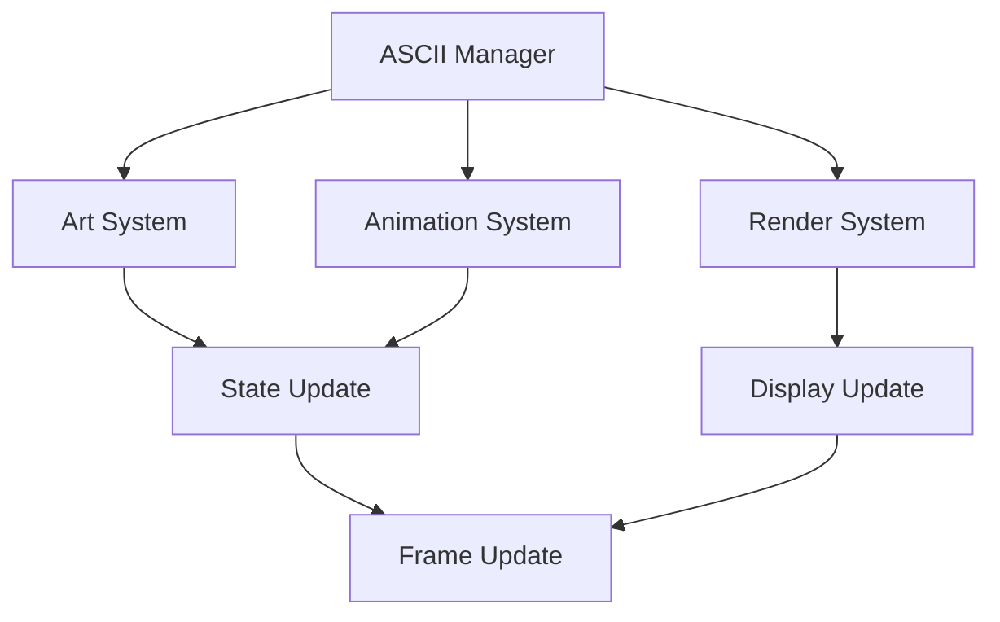
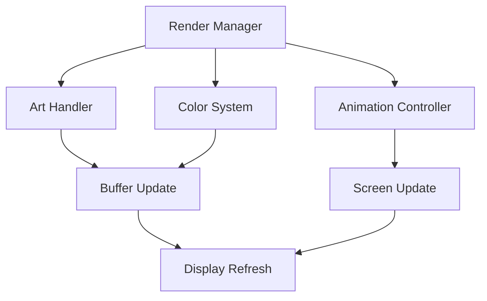

# ASCII Art System Documentation

## Overview
The ASCII Art system manages all aspects of text-based visual representation, including dynamic art generation, animation, color management, and scene composition while providing immersive visual experiences through character-based graphics.

## Core Systems

### ASCII Architecture
- **Art Types**
  - Character sprites
  - Environment scenes
  - Combat animations
  - UI elements
  - Special effects

### ASCII Structure
```python
ascii_data = {
    'art': {
        'id': art_id,
        'type': art_type,
        'frames': frame_data,
        'dimensions': art_size,
        'layers': layer_stack
    },
    'rendering': {
        'colors': color_scheme,
        'shading': shade_chars,
        'depth': depth_layers,
        'effects': visual_effects,
        'animation': anim_data
    },
    'composition': {
        'layout': scene_layout,
        'elements': scene_elements,
        'positioning': element_coords,
        'visibility': visible_layers,
        'transitions': scene_transitions
    }
}
```

### Management Pipeline


## Art System

### Character Sets
- **Set Types**
  - Basic ASCII
  - Extended ASCII
  - Unicode blocks
  - Custom symbols
  - Special characters

### Art Generation
- **Generation Methods**
  - Manual design
  - Conversion tools
  - Procedural generation
  - Template-based
  - Dynamic creation

## Animation System

### Animation Types
- **Categories**
  - Character movement
  - Combat actions
  - Environmental effects
  - UI animations
  - Scene transitions

### Frame Management
- **Frame Features**
  - Frame sequencing
  - Timing control
  - Transition effects
  - Frame buffering
  - State management

## Color System

### Color Management
- **Color Features**
  - Foreground colors
  - Background colors
  - Color palettes
  - Color gradients
  - Special effects

### Color Schemes
- **Scheme Types**
  - Basic schemes
  - Theme-based
  - Dynamic schemes
  - Environment-based
  - Special themes

## Technical Implementation

### System Pipeline


### Performance Systems
- **Optimization Methods**
  - Buffer management
  - Frame caching
  - Partial updates
  - Memory pooling
  - Resource streaming

## Integration Points

### Connected Systems
- **System Links**
  - Combat system
  - UI system
  - Environment system
  - Character system
  - Effect system

### Event Processing
- **Event Types**
  - Render events
  - Animation events
  - Update events
  - Scene events
  - Transition events

## Scene System

### Scene Composition
- **Composition Types**
  - Character scenes
  - Battle layouts
  - Environment views
  - UI layouts
  - Special scenes

### Layer Management
- **Layer Types**
  - Background layers
  - Character layers
  - Effect layers
  - UI layers
  - Overlay layers

## Development Tools

### Debug Tools
- **Tool Types**
  - Art editor
  - Animation viewer
  - Scene composer
  - Color editor
  - Performance monitor

### Testing Framework
- **Test Categories**
  - Render tests
  - Animation tests
  - Color tests
  - Integration tests
  - Performance tests

## Technical Considerations

### Performance Optimization
- **Optimization Areas**
  - Render speed
  - Memory usage
  - Buffer management
  - Update efficiency
  - Resource handling

### Resource Management
- **Management Types**
  - Art assets
  - Animation data
  - Color schemes
  - Scene data
  - Buffer data

## Future Expansions

### Planned Features
- **Enhancements**
  - Advanced animations
  - Better effects
  - Rich colors
  - Dynamic scenes
  - Special features

### System Improvements
- **Updates**
  - Better performance
  - Enhanced visuals
  - Smoother animations
  - Deeper integration
  - Advanced effects 