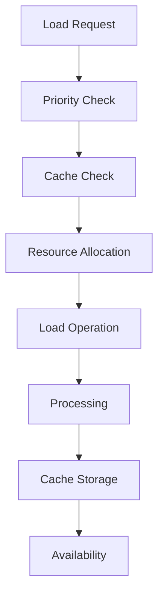
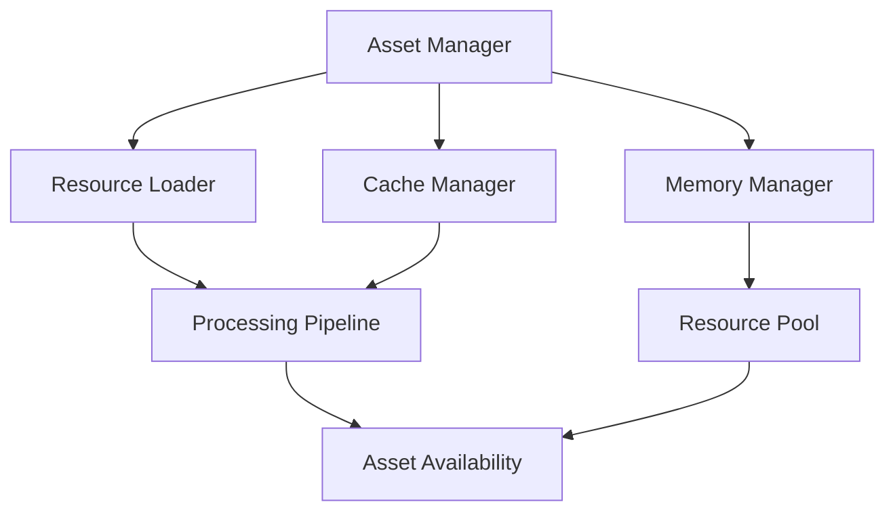

# Asset Loading System Documentation

## Overview
The Asset Loading system manages all game resources, handling efficient loading, streaming, caching, and memory management of assets while ensuring optimal performance and minimal load times.

## Core Systems

### Asset Architecture
- **Asset Types**
  - Visual Assets
    - Textures
    - Models
    - Animations
    - Effects
    - UI elements
  
  - Audio Assets
    - Music tracks
    - Sound effects
    - Voice overs
    - Ambient sounds
    - Audio effects

### Asset Structure
```python
asset_data = {
    'metadata': {
        'id': asset_id,
        'type': asset_type,
        'category': asset_category,
        'priority': load_priority,
        'version': asset_version
    },
    'properties': {
        'size': file_size,
        'format': file_format,
        'compression': compression_type,
        'quality': quality_level,
        'dependencies': dependency_list
    },
    'loading': {
        'state': load_state,
        'method': load_method,
        'cache_policy': cache_rules,
        'streaming': stream_config,
        'fallback': fallback_asset
    }
}
```

## Loading Pipeline

### Resource Management


### Loading Strategies
- **Strategy Types**
  - Preloading
  - Dynamic loading
  - Streaming
  - Background loading
  - Progressive loading

## Memory Management

### Cache System
- **Cache Types**
  - Memory cache
  - Disk cache
  - GPU cache
  - Streaming cache
  - Persistent cache

### Resource Lifecycle
- **Lifecycle Stages**
  - Initialization
  - Loading
  - Processing
  - Active use
  - Unloading

## Technical Implementation

### Loading Pipeline


### Performance Systems
- **Optimization Methods**
  - Asset bundling
  - Compression
  - Async loading
  - Memory pooling
  - Resource streaming

## Integration Points

### System Integration
- **Connected Systems**
  - Rendering system
  - Audio system
  - UI system
  - World manager
  - State system

### Event Handling
- **Event Types**
  - Load requests
  - Load completion
  - Cache updates
  - Memory warnings
  - Error events

## Quality Management

### Quality Control
- **Control Types**
  - Quality levels
  - LOD management
  - Format selection
  - Compression rates
  - Streaming quality

### Optimization System
- **Optimization Types**
  - Size optimization
  - Load optimization
  - Memory optimization
  - Cache optimization
  - Stream optimization

## Resource Streaming

### Streaming System
- **Stream Types**
  - Level streaming
  - Texture streaming
  - Audio streaming
  - Model streaming
  - Effect streaming

### Priority Management
- **Priority Levels**
  - Critical assets
  - High priority
  - Normal priority
  - Background
  - Optional

## Development Tools

### Debug Tools
- **Tool Types**
  - Asset monitor
  - Memory profiler
  - Cache inspector
  - Load analyzer
  - Stream debugger

### Testing Framework
- **Test Categories**
  - Load testing
  - Memory testing
  - Cache testing
  - Stream testing
  - Performance testing

## Technical Considerations

### Performance Optimization
- **Optimization Areas**
  - Load times
  - Memory usage
  - Cache efficiency
  - Stream performance
  - CPU/GPU usage

### Resource Management
- **Management Types**
  - Memory allocation
  - Cache management
  - Stream control
  - Version control
  - Dependency management

## Error Handling

### Error Types
- **Error Categories**
  - Load errors
  - Memory errors
  - Cache errors
  - Stream errors
  - Format errors

### Recovery Procedures
- **Recovery Steps**
  - Error detection
  - Resource cleanup
  - Cache clearing
  - Reload attempt
  - Fallback loading

## Future Expansions

### Planned Features
- **Enhancements**
  - Smart preloading
  - Better compression
  - Advanced streaming
  - Improved caching
  - Better tools

### System Improvements
- **Updates**
  - Faster loading
  - Less memory usage
  - Better streaming
  - Smarter caching
  - Enhanced debugging 