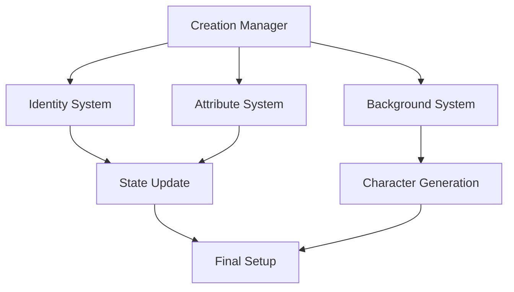
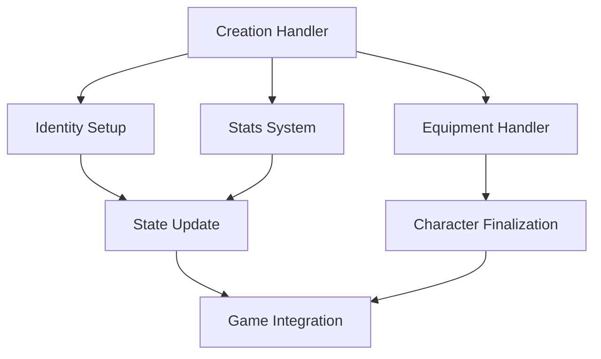

# Character Creation System Documentation

## Overview
The Character Creation system manages all aspects of player character generation, including appearance customization, background selection, attribute allocation, and starting equipment while providing meaningful choices that impact gameplay and character development.

## Core Systems

### Creation Architecture
- **Creation Types**
  - New character
  - Template-based
  - Quick creation
  - Story-driven
  - Advanced creation

### Character Structure
```python
character_data = {
    'identity': {
        'name': char_name,
        'race': char_race,
        'class': char_class,
        'background': char_background,
        'appearance': char_appearance
    },
    'attributes': {
        'base_stats': primary_attributes,
        'derived_stats': calculated_stats,
        'talents': starting_talents,
        'skills': initial_skills,
        'traits': character_traits
    },
    'background': {
        'origin': birth_place,
        'history': background_events,
        'relations': family_ties,
        'faction': starting_faction,
        'reputation': initial_standing
    }
}
```

### Creation Pipeline


## Identity System

### Race Selection
- **Race Features**
  - Racial traits
  - Ability bonuses
  - Cultural aspects
  - Starting skills
  - Special abilities

### Class System
- **Class Types**
  - Warrior paths
  - Magic users
  - Skill specialists
  - Hybrid classes
  - Special vocations

## Attribute System

### Primary Attributes
- **Core Stats**
  - Strength
  - Dexterity
  - Constitution
  - Intelligence
  - Wisdom
  - Charisma

### Derived Statistics
- **Calculated Stats**
  - Health points
  - Energy points
  - Defense values
  - Combat stats
  - Special ratings

## Background System

### Origin Stories
- **Background Types**
  - Noble birth
  - Common folk
  - Mystical origin
  - Wanderer
  - Special background

### Life Events
- **Event Categories**
  - Childhood events
  - Adolescent choices
  - Major incidents
  - Special encounters
  - Defining moments

## Equipment System

### Starting Gear
- **Equipment Types**
  - Weapons
  - Armor
  - Tools
  - Supplies
  - Special items

### Resource Allocation
- **Starting Resources**
  - Currency
  - Materials
  - Knowledge
  - Connections
  - Special resources

## Technical Implementation

### System Pipeline


### Performance Systems
- **Optimization Methods**
  - Data validation
  - State management
  - Cache handling
  - Resource loading
  - Error checking

## Integration Points

### Connected Systems
- **System Links**
  - Progression system
  - Inventory system
  - Quest system
  - Faction system
  - Skill system

### Event Processing
- **Event Types**
  - Creation events
  - Choice events
  - Setup events
  - Integration events
  - Completion events

## Customization System

### Appearance Options
- **Visual Elements**
  - Physical features
  - Clothing options
  - Special marks
  - Accessories
  - Visual effects

### Personality System
- **Character Aspects**
  - Personality traits
  - Moral alignment
  - Personal goals
  - Relationships
  - Special quirks

## Development Tools

### Debug Tools
- **Tool Types**
  - Character editor
  - Template manager
  - Stats calculator
  - Preview system
  - Validation tools

### Testing Framework
- **Test Categories**
  - Creation tests
  - Balance tests
  - Integration tests
  - Performance tests
  - Validation tests

## Technical Considerations

### Performance Optimization
- **Optimization Areas**
  - Data handling
  - Resource loading
  - State management
  - Validation checks
  - Error handling

### Resource Management
- **Management Types**
  - Character data
  - Template data
  - Asset loading
  - State data
  - Cache management

## Future Expansions

### Planned Features
- **Enhancements**
  - New races
  - New classes
  - More backgrounds
  - Better customization
  - Special options

### System Improvements
- **Updates**
  - Better balance
  - Enhanced options
  - Deeper backgrounds
  - Smoother creation
  - Advanced features 