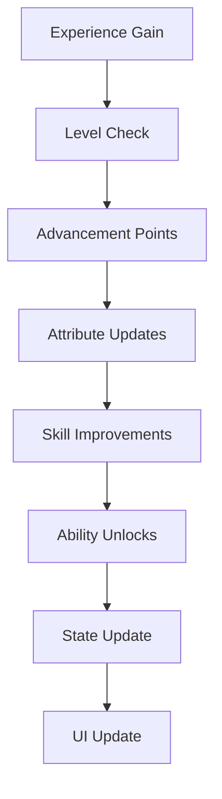
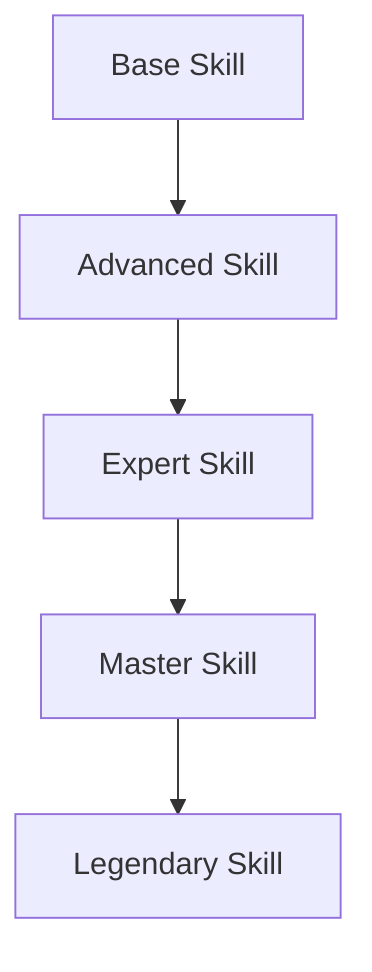
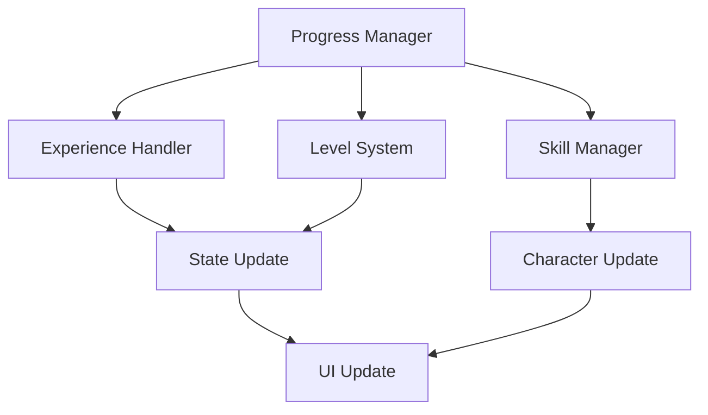

# Character Progression System Documentation

## Overview
The Character Progression system manages all aspects of player advancement, including experience gain, level progression, skill development, ability acquisition, and specialization paths while ensuring balanced growth and meaningful choices.

## Core Systems

### Experience System
- **Experience Types**
  - Combat experience
  - Quest experience
  - Crafting experience
  - Exploration experience
  - Social experience

### Level Progression
```python
progression_data = {
    'character': {
        'level': current_level,
        'experience': total_exp,
        'next_level': exp_required,
        'milestones': achieved_milestones
    },
    'attributes': {
        'base': base_attributes,
        'bonus': attribute_bonuses,
        'temporary': temp_modifiers,
        'derived': calculated_stats
    },
    'advancement': {
        'points': available_points,
        'skills': skill_progress,
        'abilities': unlocked_abilities,
        'specializations': active_specs
    }
}
```

### Progression Pipeline


### Attribute System
- **Base Attributes**
  - Strength
  - Dexterity
  - Constitution
  - Intelligence
  - Wisdom
  - Charisma

### Class System
- **Primary Classes**
  - Warrior paths
  - Mage schools
  - Rogue specialties
  - Cleric domains
  - Ranger styles

## Skill Development

### Skill Categories
- **Skill Types**
  - Combat skills
  - Magic skills
  - Crafting skills
  - Social skills
  - Utility skills

### Skill Trees


## Ability System

### Ability Types
- **Categories**
  - Active abilities
  - Passive abilities
  - Ultimate abilities
  - Support abilities
  - Utility abilities

### Ability Acquisition
- **Unlock Methods**
  - Level-based
  - Quest rewards
  - Skill mastery
  - Special events
  - Achievements

## Technical Implementation

### Progression Pipeline


### Performance Systems
- **Optimization Methods**
  - State caching
  - Batch updates
  - Event pooling
  - Data compression
  - Load balancing

## Integration Points

### Connected Systems
- **System Links**
  - Combat system
  - Quest system
  - Inventory system
  - Magic system
  - Faction system

### Event Processing
- **Event Types**
  - Experience events
  - Level events
  - Skill events
  - Ability events
  - State changes

## Cross-Class Mechanics

### Multi-classing
- **System Types**
  - Class combinations
  - Skill sharing
  - Ability merging
  - Resource pooling
  - Synergy bonuses

### Specialization Paths
- **Path Types**
  - Combat focus
  - Magic mastery
  - Hybrid styles
  - Support roles
  - Utility paths

## Balance System

### Power Scaling
- **Scale Factors**
  - Level progression
  - Skill growth
  - Ability power
  - Resource gains
  - Stat increases

### Balance Controls
- **Control Types**
  - Experience rates
  - Power curves
  - Ability costs
  - Resource limits
  - Stat caps

## Development Tools

### Debug Tools
- **Tool Types**
  - Progress viewer
  - Skill editor
  - Level tester
  - State inspector
  - Balance checker

### Testing Framework
- **Test Categories**
  - Experience tests
  - Level tests
  - Skill tests
  - Integration tests
  - Balance tests

## Technical Considerations

### Performance Optimization
- **Optimization Areas**
  - Experience tracking
  - State updates
  - Skill processing
  - UI updates
  - Data storage

### Resource Management
- **Management Types**
  - Character data
  - Progress data
  - Skill data
  - State data
  - UI assets

## Future Expansions

### Planned Features
- **Enhancements**
  - New classes
  - Advanced skills
  - Unique abilities
  - Better progression
  - Deeper specialization

### System Improvements
- **Updates**
  - Better balance
  - More flexibility
  - Enhanced feedback
  - Smoother progression
  - Better integration 