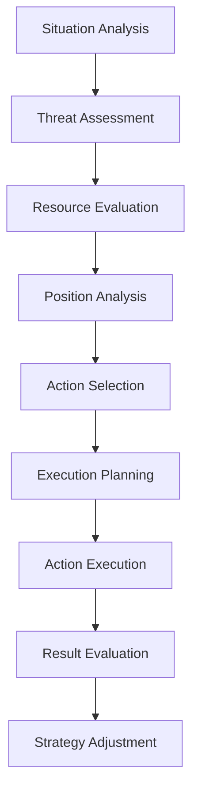
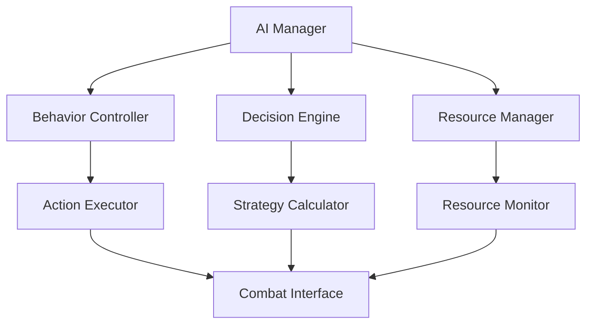

# Combat AI System Documentation

## Overview
The Combat AI system manages intelligent combat behavior, tactical decision-making, and dynamic difficulty scaling for all non-player entities in Elysian Nexus.

## Core Systems

### AI Architecture
- **AI Types**
  - Combat AI
    - Melee fighters
    - Ranged attackers
    - Spellcasters
    - Support units
    - Elite units
  
  - Tactical AI
    - Group coordinators
    - Formation managers
    - Resource controllers
    - Territory defenders
    - Special operations

### Decision Making
```python
action_score = (base_priority * tactical_value * 
                situation_modifier * resource_availability) *
                personality_factor
```

## Combat Behavior

### Behavior Types
- **Combat Roles**
  - Aggressive
    - Direct assault
    - Area control
    - Resource denial
    - Target elimination
  
  - Defensive
    - Position holding
    - Resource protection
    - Unit support
    - Tactical retreat

### Tactical Considerations
- **Decision Factors**
  - Health status: 0.2 - 1.0
  - Resource levels: 0.3 - 1.0
  - Position value: 0.5 - 2.0
  - Ally support: 0.8 - 1.5
  - Enemy threat: 1.0 - 2.5

## AI Decision Pipeline

### Decision Flow


### Action Selection
- **Priority System**
  - Immediate threats
  - Strategic objectives
  - Resource management
  - Position control
  - Support actions

## Difficulty Scaling

### Scaling Mechanics
- **Adjustment Factors**
  - Player level: 0.8 - 2.0
  - Group size: 0.7 - 1.8
  - Equipment quality: 0.6 - 1.5
  - Tactical advantage: 0.9 - 1.4
  - Environmental bonus: 0.5 - 1.3

### Dynamic Adjustment
```python
difficulty_modifier = (base_difficulty * player_power_level * 
                      group_coordination * tactical_situation) +
                      environmental_factors
```

## Group Tactics

### Formation Management
- **Formation Types**
  - Combat formations
  - Defense patterns
  - Ambush positions
  - Support arrangements
  - Special tactics

### Group Coordination
- **Coordination Elements**
  - Role assignment
  - Position control
  - Resource sharing
  - Target priority
  - Action timing

## Resource Management

### Combat Resources
- **Resource Types**
  - Health/Energy
  - Special abilities
  - Consumable items
  - Environmental aids
  - Support options

### Usage Strategy
- **Strategy Types**
  - Conservation
  - Burst usage
  - Sustained output
  - Emergency reserves
  - Tactical advantage

## Technical Implementation

### AI Processing


### Performance Systems
- **Optimization Methods**
  - Decision caching
  - Pattern recognition
  - Resource tracking
  - State management
  - Action queuing

## Integration Points

### Combat System
- **Combat Elements**
  - Action execution
  - Damage calculation
  - Status effects
  - Position tracking
  - Resource consumption

### World State
- **State Factors**
  - Environmental conditions
  - Faction influences
  - Time effects
  - Weather impact
  - Territory control

## Learning System

### Pattern Recognition
- **Learning Types**
  - Player patterns
  - Success rates
  - Failure analysis
  - Resource efficiency
  - Tactical effectiveness

### Strategy Adaptation
- **Adaptation Factors**
  - Success history
  - Resource usage
  - Position value
  - Team coordination
  - Enemy patterns

## Development Tools

### AI Tools
- **Tool Types**
  - Behavior editor
  - Pattern analyzer
  - Decision tester
  - Performance monitor
  - Debug interface

### Testing Systems
- **Test Categories**
  - Behavior testing
  - Decision validation
  - Performance analysis
  - Balance checking
  - Integration testing

## Technical Considerations

### State Management
- **State Types**
  - Combat state
  - Resource state
  - Position state
  - Decision state
  - Group state

### Performance Optimization
- Decision caching
- Pattern recognition
- Resource tracking
- State compression
- Action batching

## Future Expansions

### Planned Features
- **Enhancements**
  - Advanced tactics
  - Better coordination
  - Smarter decisions
  - Complex formations
  - Improved learning

### System Improvements
- **Updates**
  - Enhanced AI
  - Better performance
  - More strategies
  - Deeper tactics
  - Improved balance 