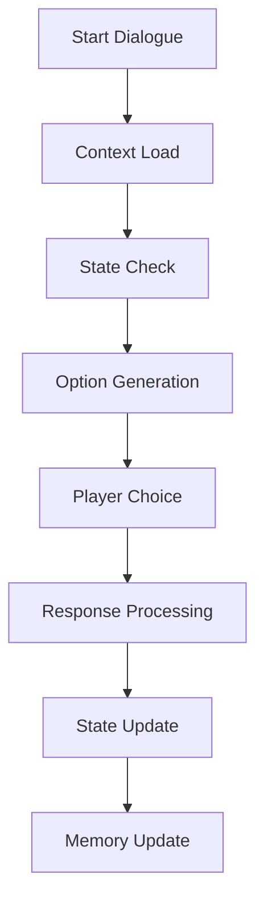
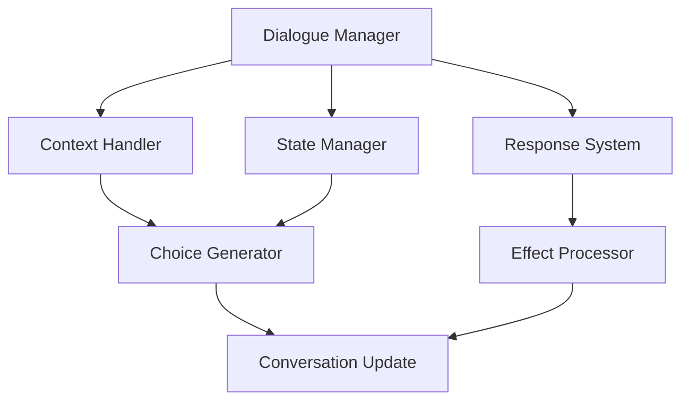

# Dialogue System Documentation

## Overview
The Dialogue system manages all conversation and interaction aspects of the game, handling NPC discussions, branching dialogues, dynamic responses, and conversation states while creating immersive and meaningful character interactions.

## Core Systems

### Dialogue Architecture
- **System Types**
  - Conversation Management
    - Dialogue trees
    - Response handling
    - State tracking
    - Condition checking
    - Memory system
  
  - Interaction Systems
    - NPC reactions
    - Emotion handling
    - Context awareness
    - Player history
    - Relationship tracking

### Dialogue Structure
```python
dialogue_data = {
    'conversation': {
        'id': dialogue_id,
        'type': conversation_type,
        'participants': participant_list,
        'state': current_state,
        'context': conversation_context
    },
    'dialogue': {
        'nodes': dialogue_nodes,
        'options': player_choices,
        'conditions': choice_conditions,
        'consequences': choice_effects,
        'branches': dialogue_branches
    },
    'memory': {
        'history': conversation_history,
        'knowledge': shared_knowledge,
        'relationships': relation_states,
        'emotions': emotional_states,
        'flags': dialogue_flags
    }
}
```

## Conversation System

### Dialogue Pipeline


### Conversation Types
- **Dialogue Categories**
  - Story dialogues
  - Quest conversations
  - Casual chat
  - Merchant talk
  - Special events

## Response System

### Response Types
- **Response Categories**
  - Information giving
  - Question asking
  - Emotional response
  - Action request
  - State change

### Choice Management
- **Choice Factors**
  - Player history
  - NPC relationship
  - Quest state
  - World state
  - Character stats

## Technical Implementation

### Processing Pipeline


### Performance Systems
- **Optimization Methods**
  - Tree caching
  - State pooling
  - Response batching
  - Memory compression
  - Context streaming

## Integration Points

### System Integration
- **Connected Systems**
  - Quest system
  - Faction system
  - Memory system
  - Animation system
  - UI system

### Event Handling
- **Event Types**
  - Dialogue events
  - State changes
  - Relationship updates
  - Knowledge gains
  - Quest triggers

## Memory System

### Memory Types
- **Memory Categories**
  - Conversation history
  - Relationship memory
  - Quest memory
  - World knowledge
  - Personal history

### State Management
- **State Types**
  - Conversation states
  - Emotional states
  - Knowledge states
  - Relationship states
  - Quest states

## Emotional System

### Emotion Types
- **Emotion Categories**
  - Basic emotions
  - Complex feelings
  - Relationship states
  - Mood effects
  - Personality traits

### Expression System
- **Expression Types**
  - Verbal responses
  - Facial animations
  - Body language
  - Tone changes
  - Special reactions

## Development Tools

### Debug Tools
- **Tool Types**
  - Dialogue editor
  - Tree visualizer
  - State inspector
  - Memory viewer
  - Test simulator

### Testing Framework
- **Test Categories**
  - Dialogue tests
  - Branch tests
  - State tests
  - Memory tests
  - Integration tests

## Technical Considerations

### Performance Optimization
- **Optimization Areas**
  - Tree traversal
  - State updates
  - Memory access
  - Response generation
  - Animation sync

### Resource Management
- **Resource Types**
  - Dialogue trees
  - Voice assets
  - Animation data
  - State data
  - Memory storage

## Error Handling

### Error Types
- **Error Categories**
  - Dialogue errors
  - State errors
  - Memory errors
  - Branch errors
  - Integration errors

### Recovery Procedures
- **Recovery Steps**
  - Error detection
  - State recovery
  - Tree repair
  - Memory validation
  - Conversation reset

## Future Expansions

### Planned Features
- **Enhancements**
  - Dynamic dialogue
  - Better emotions
  - Deeper memory
  - More branches
  - Voice integration

### System Improvements
- **Updates**
  - Natural language
  - Better reactions
  - Enhanced memory
  - More contexts
  - Better branching 