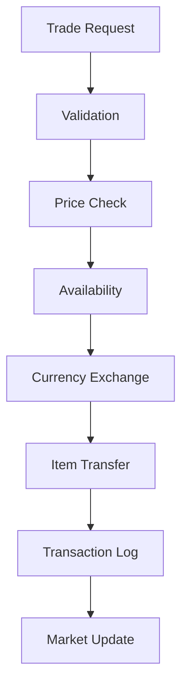
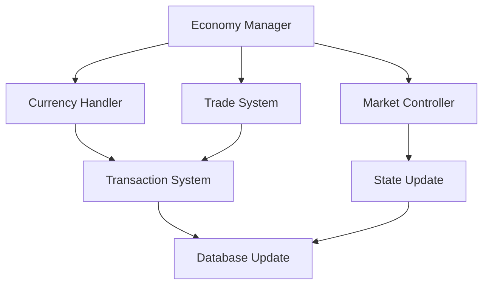

# Economy System Documentation

## Overview
The Economy system manages all financial and trading aspects of the game, handling currency flow, market dynamics, trading mechanisms, and economic balance while ensuring a sustainable and engaging player economy.

## Core Systems

### Economy Architecture
- **System Types**
  - Currency Systems
    - Primary currency
    - Premium currency
    - Faction currencies
    - Special tokens
    - Resource credits
  
  - Trading Systems
    - Player trading
    - NPC vendors
    - Auction house
    - Market system
    - Contract trading

### Economy Structure
```python
economy_data = {
    'currency': {
        'type': currency_type,
        'amount': current_amount,
        'source': currency_source,
        'limits': currency_limits,
        'exchange': exchange_rates
    },
    'market': {
        'items': market_listings,
        'prices': price_data,
        'trends': market_trends,
        'volume': trade_volume,
        'history': price_history
    },
    'transactions': {
        'type': transaction_type,
        'parties': involved_entities,
        'items': traded_items,
        'value': transaction_value,
        'timestamp': transaction_time
    }
}
```

## Market System

### Trading Pipeline


### Market Types
- **Trading Categories**
  - Direct trading
  - Auction trading
  - Vendor trading
  - Contract trading
  - Batch trading

## Currency Management

### Currency Types
- **Currency Categories**
  - Gold/Primary
  - Premium/Cash
  - Reputation
  - Event tokens
  - Special currency

### Flow Control
- **Control Methods**
  - Income sources
  - Sinks/Costs
  - Exchange rates
  - Limits/Caps
  - Conversion rules

## Technical Implementation

### Economy Pipeline


### Performance Systems
- **Optimization Methods**
  - Transaction batching
  - Cache management
  - State compression
  - Async processing
  - Load balancing

## Integration Points

### System Integration
- **Connected Systems**
  - Inventory system
  - Quest system
  - Crafting system
  - Achievement system
  - Player system

### Event Handling
- **Event Types**
  - Trade events
  - Currency events
  - Market events
  - Price changes
  - System events

## Market Dynamics

### Price System
- **Price Factors**
  - Supply/Demand
  - Rarity
  - Quality
  - Season/Time
  - Special events

### Market Analysis
- **Analysis Types**
  - Price trends
  - Volume analysis
  - Market health
  - Player behavior
  - Economic indicators

## Trading Features

### Trade Types
- **Trading Methods**
  - Direct trade
  - Market listing
  - Auction bidding
  - Contract deals
  - Bulk trading

### Security System
- **Security Features**
  - Trade validation
  - Anti-fraud
  - Value checks
  - Rate limiting
  - Transaction logging

## Development Tools

### Debug Tools
- **Tool Types**
  - Economy monitor
  - Trade simulator
  - Market analyzer
  - Currency tracker
  - Transaction logger

### Testing Framework
- **Test Categories**
  - Trade tests
  - Currency tests
  - Market tests
  - Performance tests
  - Security tests

## Technical Considerations

### Performance Optimization
- **Optimization Areas**
  - Transaction speed
  - Market updates
  - Data storage
  - Query efficiency
  - State management

### Data Management
- **Management Types**
  - Transaction data
  - Market history
  - Price tracking
  - Player records
  - Analytics data

## Error Handling

### Error Types
- **Error Categories**
  - Transaction errors
  - Currency errors
  - Market errors
  - Validation errors
  - System errors

### Recovery Procedures
- **Recovery Steps**
  - Error detection
  - Transaction rollback
  - State recovery
  - Data validation
  - System restoration

## Future Expansions

### Planned Features
- **Enhancements**
  - Advanced trading
  - Market features
  - Better analytics
  - More currencies
  - Enhanced security

### System Improvements
- **Updates**
  - Better performance
  - More flexibility
  - Enhanced UI/UX
  - Improved tracking
  - Better balance 