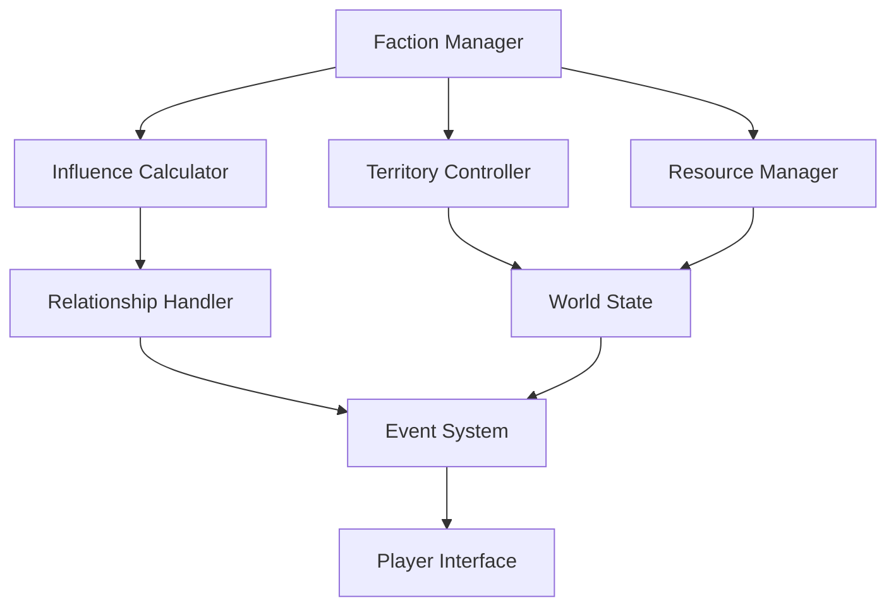

# Faction Influence Subsystem Documentation

## Overview
The Faction Influence subsystem manages the complex web of relationships, power dynamics, and territorial control between the eight major factions of Elysian Nexus.

## Core Systems

### Influence Mechanics
- **Influence Types**
  - Political Influence (Governance and diplomacy)
  - Military Influence (Combat and defense)
  - Economic Influence (Trade and resources)
  - Cultural Influence (Beliefs and practices)
  - Magical Influence (Mystical power)

### Faction Relationships
- **Relationship States**
  - Allied (75-100)
  - Friendly (50-74)
  - Neutral (25-49)
  - Suspicious (1-24)
  - Hostile (-50-0)
  - At War (-100--51)

### Territory Control
- **Control Levels**
  - Absolute (90-100%)
  - Strong (70-89%)
  - Moderate (40-69%)
  - Weak (20-39%)
  - Minimal (0-19%)

## Influence Calculations

### Base Formula
```python
influence_change = (base_action_value * relationship_modifier * 
                   territory_control_factor * player_reputation_modifier *
                   faction_power_ratio) * event_multiplier
```

### Modifier Systems
- **Action Modifiers**
  - Diplomatic: 0.5 - 2.0
  - Military: 0.8 - 2.5
  - Economic: 0.6 - 1.8
  - Cultural: 0.4 - 1.5
  - Magical: 0.7 - 2.2

- **Territory Modifiers**
  - Core Territory: 1.5
  - Claimed Territory: 1.2
  - Contested Territory: 0.8
  - Enemy Territory: 0.5

## Faction Dynamics

### Power Balance
- **Power Metrics**
  - Territory Size
  - Resource Control
  - Military Strength
  - Economic Power
  - Magical Influence

### Alliance System
- **Alliance Types**
  - Military Alliance
  - Economic Partnership
  - Cultural Exchange
  - Magical Coalition
  - Full Alliance

### Conflict Resolution
- **Conflict Types**
  - Border Disputes
  - Resource Wars
  - Ideological Conflicts
  - Magical Disputes
  - Trade Wars

## Resource Management

### Resource Types
- **Strategic Resources**
  - Military Assets
  - Economic Resources
  - Magical Artifacts
  - Cultural Relics
  - Political Capital

### Resource Distribution
- **Distribution Factors**
  - Territory Control
  - Population Size
  - Infrastructure Level
  - Magical Saturation
  - Trade Routes

## Faction Activities

### Diplomatic Actions
- **Action Types**
  - Trade Agreements
  - Military Pacts
  - Cultural Exchange
  - Knowledge Sharing
  - Territory Negotiation

### Military Operations
- **Operation Types**
  - Territory Defense
  - Resource Acquisition
  - Strategic Conquest
  - Allied Support
  - Peacekeeping

## Player Integration

### Reputation System
- **Reputation Levels**
  - Exalted (90-100)
  - Revered (70-89)
  - Honored (50-69)
  - Respected (30-49)
  - Neutral (10-29)
  - Distrusted (-30-9)
  - Hostile (-100--31)

### Player Actions
- **Action Categories**
  - Diplomatic Missions
  - Military Support
  - Economic Aid
  - Cultural Activities
  - Magical Assistance

## Event System

### Event Types
- **Major Events**
  - Faction Wars
  - Alliance Formation
  - Territory Changes
  - Resource Discovery
  - Magical Phenomena

### Event Impact
- **Impact Areas**
  - Territory Control
  - Resource Distribution
  - Faction Relations
  - Power Balance
  - World State

## Technical Implementation

### System Architecture


### State Management
- **State Types**
  - Faction States
  - Territory States
  - Resource States
  - Relationship States
  - Event States

### Performance Optimization
- Cached calculations
- Batch updates
- Event queuing
- State compression
- Efficient storage

## Integration Points

### Combat System
- Faction bonuses
- Territory advantages
- Resource benefits
- Alliance support
- Enemy penalties

### Economic System
- Trade relations
- Resource sharing
- Market influence
- Development costs
- Investment returns

### Quest System
- Faction missions
- Territory quests
- Resource gathering
- Diplomatic tasks
- War campaigns

## Future Expansions

### Planned Features
- Dynamic alliances
- Complex diplomacy
- Advanced warfare
- Economic systems
- Cultural mechanics

### System Improvements
- Enhanced AI
- Better balancing
- More events
- Deeper interactions
- Improved feedback 