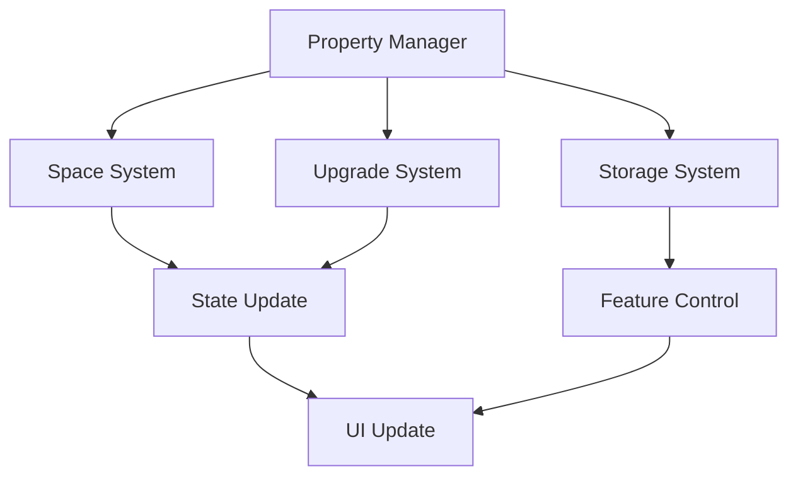
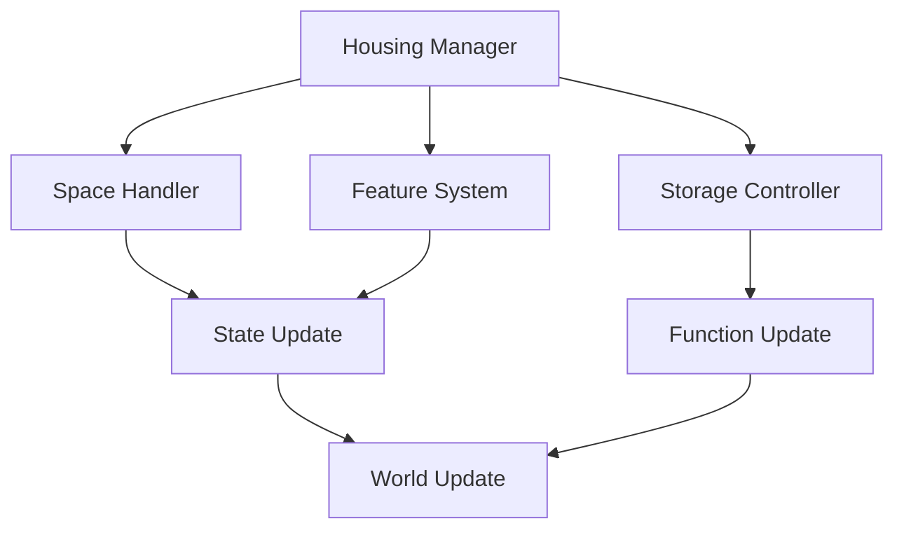

# Housing System Documentation

## Overview
The Housing system manages all aspects of player properties and bases, including acquisition, customization, upgrades, functionality, and maintenance while providing meaningful progression and strategic advantages through property ownership.

## Core Systems

### Property Architecture
- **Property Types**
  - Personal homes
  - Guild halls
  - Faction bases
  - Pocket dimensions
  - Dimensional anchors

### Property Structure
```python
property_data = {
    'base': {
        'id': property_id,
        'type': property_type,
        'location': spatial_coords,
        'size': property_size
    },
    'features': {
        'rooms': active_rooms,
        'facilities': installed_facilities,
        'storage': storage_capacity,
        'security': security_level,
        'utilities': utility_systems
    },
    'customization': {
        'style': visual_theme,
        'furniture': placed_items,
        'decorations': active_decor,
        'layout': room_arrangement,
        'upgrades': installed_upgrades
    }
}
```

### Management Pipeline


## Space System

### Room Types
- **Room Categories**
  - Living spaces
  - Crafting rooms
  - Storage areas
  - Magical chambers
  - Training halls

### Layout Management
- **Layout Features**
  - Room placement
  - Connection paths
  - Expansion zones
  - Portal locations
  - Utility grids

## Customization System

### Visual Elements
- **Design Options**
  - Architecture style
  - Color schemes
  - Lighting effects
  - Material types
  - Atmospheric effects

### Furniture System
- **Furniture Types**
  - Functional items
  - Decorative pieces
  - Storage units
  - Magical artifacts
  - Utility objects

## Functionality System

### Utility Features
- **Feature Types**
  - Crafting stations
  - Storage systems
  - Portal networks
  - Recovery areas
  - Training facilities

### Service Systems
- **Service Types**
  - Maintenance
  - Security
  - Automation
  - Resource generation
  - Environmental control

## Storage Integration

### Storage Types
- **Storage Categories**
  - Item storage
  - Resource banks
  - Equipment racks
  - Magical containers
  - Archive systems

### Management System
- **Management Features**
  - Capacity control
  - Organization tools
  - Search functions
  - Auto-sorting
  - Access control

## Technical Implementation

### System Pipeline


### Performance Systems
- **Optimization Methods**
  - Space partitioning
  - Asset streaming
  - State caching
  - Load balancing
  - Resource pooling

## Integration Points

### Connected Systems
- **System Links**
  - Inventory system
  - Crafting system
  - Portal system
  - Economy system
  - Social system

### Event Processing
- **Event Types**
  - Property events
  - Storage events
  - Upgrade events
  - Maintenance events
  - Access events

## Progression System

### Upgrade Paths
- **Upgrade Types**
  - Space expansion
  - Feature unlocks
  - Security upgrades
  - Utility enhancements
  - Aesthetic improvements

### Development Stages
- **Stage Types**
  - Initial setup
  - Basic expansion
  - Advanced features
  - Master upgrades
  - Legendary status

## Development Tools

### Debug Tools
- **Tool Types**
  - Property editor
  - Layout designer
  - Feature tester
  - State inspector
  - Performance monitor

### Testing Framework
- **Test Categories**
  - Space tests
  - Feature tests
  - Storage tests
  - Integration tests
  - Performance tests

## Technical Considerations

### Performance Optimization
- **Optimization Areas**
  - Space rendering
  - Asset loading
  - State updates
  - Storage access
  - Feature processing

### Resource Management
- **Management Types**
  - Property data
  - Asset resources
  - State data
  - Feature data
  - User settings

## Future Expansions

### Planned Features
- **Enhancements**
  - New properties
  - Advanced features
  - Deep customization
  - Better integration
  - Special functions

### System Improvements
- **Updates**
  - Better performance
  - Enhanced visuals
  - Deeper functionality
  - Smoother integration
  - Advanced automation 