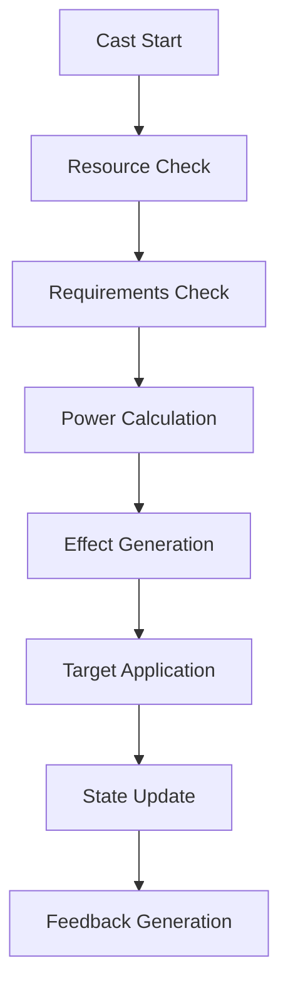
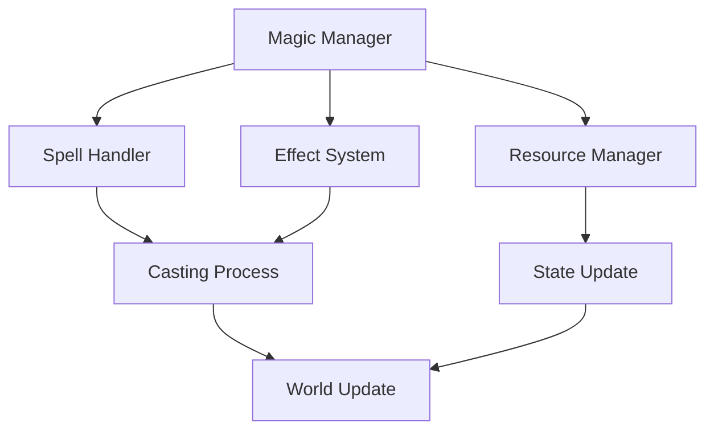

# Magic System Documentation

## Overview
The Magic system manages all arcane aspects of the game, handling spell casting, magical effects, enchantments, and mystical interactions while providing deep customization and strategic depth in magical combat and utility.

## Core Systems

### Magic Architecture
- **System Types**
  - Spell Systems
    - Spell casting
    - Effect generation
    - Resource management
    - Cooldown tracking
    - Combo mechanics
  
  - School Management
    - Elemental magic
    - Divine magic
    - Void magic
    - Blood magic
    - Nature magic

### Magic Structure
```python
magic_data = {
    'spell': {
        'id': spell_id,
        'school': magic_school,
        'type': spell_type,
        'power': base_power,
        'requirements': cast_requirements
    },
    'casting': {
        'cost': resource_cost,
        'time': cast_time,
        'range': spell_range,
        'targeting': target_type,
        'components': required_components
    },
    'effects': {
        'primary': main_effect,
        'secondary': side_effects,
        'duration': effect_duration,
        'area': effect_area,
        'modifiers': effect_modifiers
    }
}
```

## Spell System

### Casting Pipeline


### Spell Types
- **Magic Categories**
  - Combat spells
  - Utility spells
  - Ritual magic
  - Enchantments
  - Summoning

## Effect System

### Effect Types
- **Effect Categories**
  - Damage effects
  - Status effects
  - Transformation
  - Control effects
  - Environmental

### Power Calculation
- **Power Factors**
  - Caster level
  - Equipment bonus
  - Magical affinity
  - Environmental state
  - Resource investment

## Technical Implementation

### Magic Pipeline


### Performance Systems
- **Optimization Methods**
  - Effect pooling
  - Spell caching
  - Batch processing
  - State compression
  - Resource tracking

## Integration Points

### System Integration
- **Connected Systems**
  - Combat system
  - Animation system
  - Particle system
  - Sound system
  - Physics system

### Event Handling
- **Event Types**
  - Cast events
  - Effect events
  - Resource events
  - Interaction events
  - State changes

## Resource System

### Magic Resources
- **Resource Types**
  - Mana pools
  - Energy types
  - Reagents
  - Focus items
  - Catalysts

### Resource Management
- **Management Types**
  - Generation
  - Consumption
  - Storage
  - Conversion
  - Recovery

## School System

### Magic Schools
- **School Types**
  - Elemental paths
  - Divine domains
  - Void aspects
  - Blood arts
  - Nature bonds

### School Interactions
- **Interaction Types**
  - Synergies
  - Conflicts
  - Enhancements
  - Suppressions
  - Combinations

## Development Tools

### Debug Tools
- **Tool Types**
  - Spell editor
  - Effect viewer
  - Power calculator
  - Resource monitor
  - State inspector

### Testing Framework
- **Test Categories**
  - Spell tests
  - Effect tests
  - Resource tests
  - Integration tests
  - Balance tests

## Technical Considerations

### Performance Optimization
- **Optimization Areas**
  - Effect processing
  - Resource tracking
  - State updates
  - Visual effects
  - Sound processing

### Resource Management
- **Management Types**
  - Spell data
  - Effect data
  - Resource data
  - State data
  - Visual assets

## Error Handling

### Error Types
- **Error Categories**
  - Cast errors
  - Effect errors
  - Resource errors
  - State errors
  - Integration errors

### Recovery Procedures
- **Recovery Steps**
  - Error detection
  - State recovery
  - Resource refund
  - Effect cleanup
  - System reset

## Future Expansions

### Planned Features
- **Enhancements**
  - New schools
  - Complex spells
  - Dynamic effects
  - Better visuals
  - Advanced combos

### System Improvements
- **Updates**
  - Better performance
  - More flexibility
  - Enhanced feedback
  - Deeper mechanics
  - Better balance 