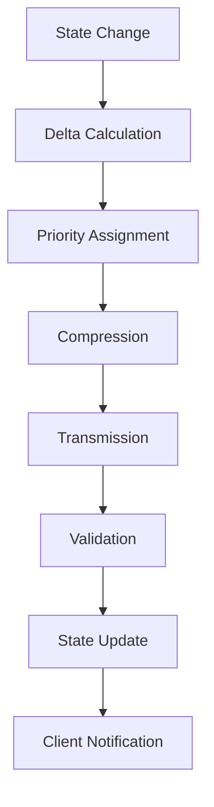
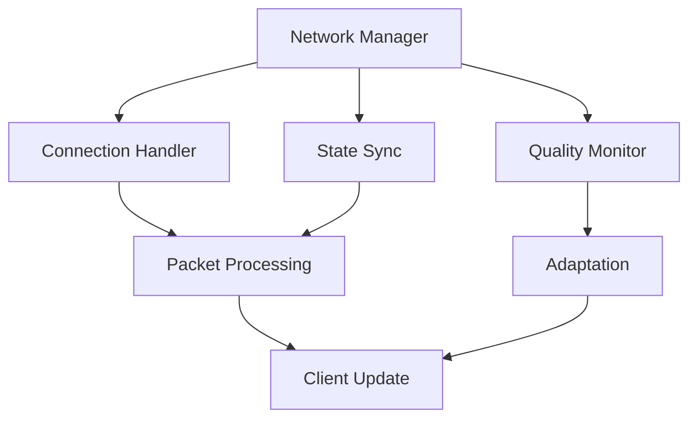

# Network Synchronization System Documentation

## Overview
The Network Synchronization system manages all multiplayer aspects of the game, handling state synchronization, client-server communication, latency compensation, and ensuring consistent gameplay experiences across different network conditions.

## Core Systems

### Network Architecture
- **System Types**
  - Server Components
    - State manager
    - Client handler
    - Authentication
    - Session manager
    - World instance
  
  - Client Components
    - Connection manager
    - State reconciliation
    - Input prediction
    - Entity interpolation
    - Cache manager

### Data Structure
```python
network_packet = {
    'metadata': {
        'id': packet_id,
        'type': packet_type,
        'timestamp': send_time,
        'priority': priority_level,
        'reliability': reliability_type
    },
    'payload': {
        'state': state_data,
        'delta': delta_changes,
        'inputs': input_data,
        'events': event_list,
        'validation': checksum
    },
    'routing': {
        'source': sender_id,
        'target': target_id,
        'path': route_data,
        'hop_count': hop_number
    }
}
```

## Synchronization Pipeline

### State Management


### Replication System
- **Replication Types**
  - Full state
  - Delta updates
  - Predictive states
  - Rollback states
  - Interpolated states

## Latency Management

### Compensation Systems
- **Compensation Types**
  - Input prediction
  - Client-side prediction
  - Server reconciliation
  - Lag compensation
  - Jitter buffer

### Network Quality
- **Quality Metrics**
  - Ping time
  - Packet loss
  - Jitter
  - Bandwidth
  - Connection stability

## Technical Implementation

### Network Pipeline


### Performance Systems
- **Optimization Methods**
  - Packet batching
  - Delta compression
  - Priority queuing
  - Bandwidth optimization
  - State caching

## Integration Points

### System Integration
- **Connected Systems**
  - Game state
  - Physics system
  - Combat system
  - Player manager
  - World manager

### Event Handling
- **Event Types**
  - State updates
  - Player actions
  - World events
  - System messages
  - Error notifications

## Security Features

### Security Systems
- **Protection Types**
  - Authentication
  - Encryption
  - Anti-cheat
  - Rate limiting
  - Validation checks

### Validation System
- **Validation Types**
  - State validation
  - Input validation
  - Client validation
  - Action validation
  - Data integrity

## Session Management

### Session Control
- **Control Types**
  - Connection handling
  - Player tracking
  - Instance management
  - Load balancing
  - Session recovery

### Instance Management
- **Instance Types**
  - World instances
  - Combat instances
  - Private instances
  - Shared instances
  - Event instances

## Development Tools

### Debug Tools
- **Tool Types**
  - Network monitor
  - Latency simulator
  - Packet inspector
  - State debugger
  - Connection tester

### Testing Framework
- **Test Categories**
  - Connection testing
  - Load testing
  - Latency testing
  - State sync testing
  - Security testing

## Technical Considerations

### Performance Optimization
- **Optimization Areas**
  - Bandwidth usage
  - CPU overhead
  - Memory usage
  - State updates
  - Packet size

### State Consistency
- **Consistency Types**
  - Client states
  - Server states
  - Predicted states
  - Validated states
  - Reconciled states

## Error Handling

### Error Types
- **Error Categories**
  - Connection errors
  - Sync errors
  - State errors
  - Validation errors
  - Security errors

### Recovery Procedures
- **Recovery Steps**
  - Error detection
  - State recovery
  - Connection recovery
  - Data validation
  - Client resync

## Future Expansions

### Planned Features
- **Enhancements**
  - Better prediction
  - Advanced security
  - Improved sync
  - More instances
  - Better tools

### System Improvements
- **Updates**
  - Lower latency
  - Better stability
  - More scalability
  - Enhanced security
  - Better debugging 