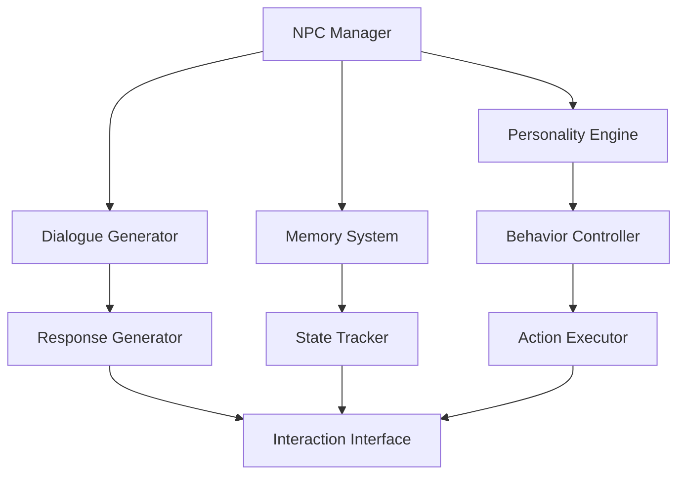

# NPC Interaction Subsystem Documentation

## Overview
The NPC Interaction subsystem manages all aspects of NPC behavior, dialogue, relationships, and memory, creating dynamic and meaningful character interactions throughout Elysian Nexus.

## Core Systems

### NPC Architecture
- **NPC Types**
  - Story NPCs
    - Major characters
    - Quest givers
    - Faction leaders
    - Merchants
    - Trainers
  
  - Dynamic NPCs
    - Citizens
    - Guards
    - Travelers
    - Creatures
    - Spirits

### Personality System
- **Core Traits**
  - Disposition
  - Intelligence
  - Empathy
  - Ambition
  - Loyalty

## Dialogue Generation

### Dialogue Structure
```python
dialogue_response = {
    'content': generated_text,
    'tone': emotional_state,
    'context': {
        'relationship': relation_status,
        'knowledge': known_facts,
        'faction': faction_alignment,
        'mood': current_mood
    },
    'options': available_responses
}
```

### Generation Parameters
- **Influence Factors**
  - Relationship: 0.5 - 2.0
  - Faction Standing: 0.7 - 1.8
  - Time of Day: 0.9 - 1.2
  - World State: 0.8 - 1.5
  - Previous Interactions: 0.6 - 1.4

## Memory System

### Memory Types
- **Long-term Memory**
  - Character History
  - Major Events
  - Relationship Status
  - Important Decisions
  - Quest Progress

### Short-term Memory
- **Recent Events**
  - Current Conversation
  - Daily Activities
  - Immediate Needs
  - Local Changes
  - Temporary States

## Relationship Management

### Relationship Metrics
- **Core Metrics**
  - Trust Level
  - Friendship
  - Respect
  - Fear
  - Influence

### Relationship Formula
```python
relationship_change = (base_action_value * personality_modifier * 
                      faction_influence * previous_interactions) +
                      event_impact
```

## Behavior Patterns

### Daily Routines
- **Schedule Types**
  - Work Pattern
  - Social Activities
  - Rest Periods
  - Special Events
  - Emergency Responses

### Dynamic Behavior
- **Behavior Factors**
  - Current Goals
  - Emotional State
  - Environmental Conditions
  - Social Context
  - World Events

## Technical Implementation

### AI Architecture


### Performance Systems
- **Optimization Methods**
  - Response Caching
  - Memory Compression
  - Behavior Batching
  - State Management
  - Priority Processing

## Integration Points

### Quest System
- **Quest Elements**
  - Quest Assignment
  - Progress Tracking
  - Reward Distribution
  - Failure Handling
  - Alternative Paths

### Faction System
- **Faction Integration**
  - Alignment Impact
  - Relationship Modifiers
  - Resource Access
  - Territory Effects
  - Political Influence

## Event Processing

### Event Types
- **NPC Events**
  - Conversation Start
  - Relationship Change
  - Knowledge Update
  - Mood Shift
  - Schedule Change

### Event Handlers
- **Handler Types**
  - Dialogue Manager
  - State Updater
  - Memory Recorder
  - Behavior Adjuster
  - Response Generator

## Resource Management

### Memory Resources
- **Resource Types**
  - Dialogue History
  - Relationship Data
  - Event Records
  - Knowledge Base
  - Behavior Patterns

### Processing Resources
- **Resource Usage**
  - CPU Allocation
  - Memory Usage
  - Storage Space
  - Network Load
  - Response Time

## Technical Considerations

### State Management
- **State Types**
  - Conversation State
  - Relationship State
  - Memory State
  - Behavior State
  - Interaction State

### Performance Optimization
- Response generation caching
- Memory state compression
- Behavior calculation batching
- Interaction state tracking
- Resource management

## Future Expansions

### Planned Features
- **Enhancements**
  - Complex personalities
  - Dynamic relationships
  - Advanced memory
  - Better responses
  - Realistic behavior

### System Improvements
- **Updates**
  - Enhanced AI
  - Better dialogue
  - More interactions
  - Deeper relationships
  - Improved memory

## NPC Development Tools

### Creation Tools
- **Tool Types**
  - Personality Editor
  - Dialogue Creator
  - Schedule Planner
  - Relationship Manager
  - Memory Editor

### Testing Tools
- **Test Types**
  - Dialogue Testing
  - Behavior Simulation
  - Memory Verification
  - Relationship Testing
  - Performance Analysis

## Documentation

### API Documentation
- **Interface Types**
  - NPC Creation
  - Dialogue Management
  - Memory Access
  - Behavior Control
  - State Management

### Usage Guidelines
- **Guidelines**
  - Best Practices
  - Common Patterns
  - Error Handling
  - Performance Tips
  - Integration Guide 