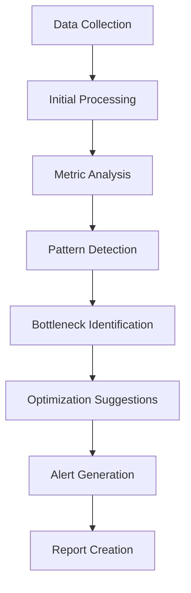
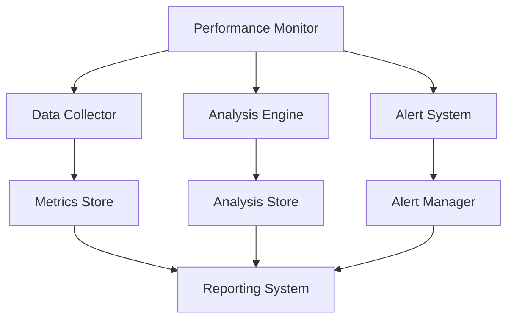

# Performance Monitoring System Documentation

## Overview
The Performance Monitoring system tracks, analyzes, and optimizes game performance across all subsystems, providing real-time monitoring, bottleneck detection, and optimization recommendations.

## Core Systems

### Monitoring Types
- **Performance Categories**
  - System Performance
    - CPU usage
    - Memory allocation
    - I/O operations
    - Network traffic
    - Thread management
  
  - Game Performance
    - Frame rate
    - Update time
    - Render time
    - Physics calculations
    - AI processing

### Metrics Collection
```python
performance_metrics = {
    'system': {
        'cpu_usage': current_cpu,
        'memory_usage': memory_stats,
        'io_operations': io_stats,
        'thread_count': active_threads,
        'network_traffic': network_stats
    },
    'game': {
        'frame_time': frame_stats,
        'update_time': update_stats,
        'render_time': render_stats,
        'physics_time': physics_stats,
        'ai_time': ai_stats
    }
}
```

## Monitoring Systems

### Real-time Monitoring
- **Monitor Types**
  - Resource usage
  - Performance metrics
  - System health
  - Error rates
  - Bottlenecks

### Data Collection
- **Collection Methods**
  - Continuous monitoring
  - Interval sampling
  - Event triggers
  - Threshold alerts
  - Profile snapshots

## Analysis Pipeline

### Data Processing


### Analysis Types
- **Analysis Categories**
  - Performance trends
  - Resource usage
  - System bottlenecks
  - Error patterns
  - Optimization opportunities

## Optimization Tools

### Performance Tools
- **Tool Types**
  - Profilers
  - Memory analyzers
  - Thread monitors
  - I/O analyzers
  - Network monitors

### Optimization Methods
- **Method Types**
  - Code optimization
  - Resource management
  - Cache utilization
  - Load balancing
  - Threading improvements

## Technical Implementation

### Monitoring Architecture


### Performance Systems
- **System Types**
  - Data collection
  - Real-time analysis
  - Alert generation
  - Report creation
  - Optimization suggestions

## Integration Points

### System Integration
- **Connected Systems**
  - Game engine
  - Resource manager
  - State system
  - Network manager
  - Storage system

### Data Flow
- **Flow Types**
  - Metric collection
  - Performance data
  - System states
  - Error reports
  - Optimization data

## Alerting System

### Alert Types
- **Alert Categories**
  - Performance alerts
  - Resource warnings
  - Error notifications
  - System issues
  - Optimization suggestions

### Alert Priorities
- **Priority Levels**
  - Critical (Immediate action)
  - High (Urgent attention)
  - Medium (Planned response)
  - Low (Monitoring required)
  - Info (Awareness only)

## Reporting System

### Report Types
- **Report Categories**
  - Real-time reports
  - Performance summaries
  - Trend analysis
  - System health
  - Optimization recommendations

### Report Generation
- **Generation Types**
  - Automated reports
  - Scheduled reports
  - Event-triggered reports
  - Custom reports
  - Alert reports

## Development Tools

### Debug Tools
- **Tool Types**
  - Performance profiler
  - Memory analyzer
  - Thread monitor
  - Network analyzer
  - System monitor

### Testing Tools
- **Test Categories**
  - Performance testing
  - Load testing
  - Stress testing
  - Endurance testing
  - Recovery testing

## Technical Considerations

### Data Management
- **Management Types**
  - Data collection
  - Data storage
  - Data analysis
  - Data retention
  - Data cleanup

### Performance Impact
- **Impact Areas**
  - Monitoring overhead
  - Storage requirements
  - Processing load
  - Network usage
  - Memory usage

## Error Handling

### Error Types
- **Error Categories**
  - Collection errors
  - Analysis errors
  - Storage errors
  - Processing errors
  - Reporting errors

### Recovery Procedures
- **Recovery Steps**
  - Error detection
  - Impact assessment
  - Recovery action
  - Data validation
  - System restoration

## Future Expansions

### Planned Features
- **Enhancements**
  - Advanced analytics
  - Machine learning
  - Predictive analysis
  - Automated optimization
  - Enhanced visualization

### System Improvements
- **Updates**
  - Better monitoring
  - Faster analysis
  - More accuracy
  - Lower overhead
  - Better insights 