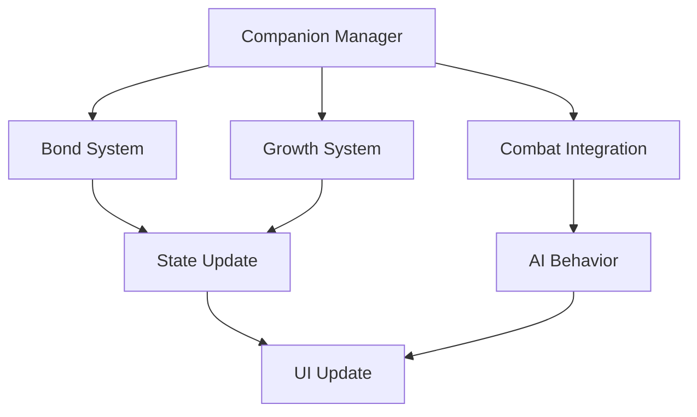
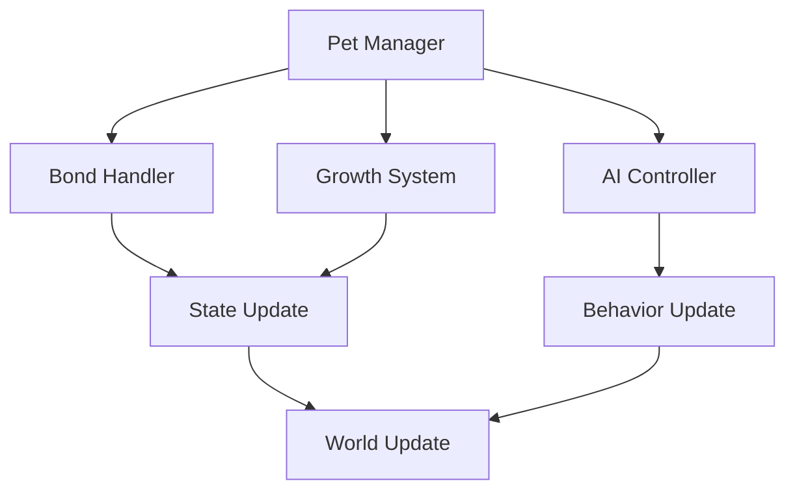

# Pet/Companion System Documentation

## Overview
The Pet/Companion system manages all aspects of companion creatures and familiars, including acquisition, bonding, development, combat integration, and companion care while providing meaningful interactions and strategic depth to the player's journey.

## Core Systems

### Companion Architecture
- **Companion Types**
  - Combat pets
  - Utility companions
  - Mount creatures
  - Magical familiars
  - Guardian spirits

### Companion Structure
```python
companion_data = {
    'base': {
        'id': companion_id,
        'type': companion_type,
        'level': current_level,
        'bond': bond_strength
    },
    'stats': {
        'health': base_health,
        'power': attack_power,
        'defense': defense_rating,
        'speed': movement_speed,
        'abilities': special_skills
    },
    'development': {
        'experience': total_exp,
        'traits': active_traits,
        'skills': learned_skills,
        'bond_level': relationship_tier
    }
}
```

### Management Pipeline


## Bond System

### Bond Mechanics
- **Bond Types**
  - Emotional bond
  - Combat synergy
  - Magical link
  - Spirit connection
  - Neural sync

### Bond Development
- **Development Factors**
  - Time spent together
  - Shared victories
  - Care activities
  - Training sessions
  - Special events

## Growth System

### Progression Types
- **Growth Categories**
  - Level advancement
  - Skill acquisition
  - Trait development
  - Bond strengthening
  - Ability unlocks

### Training Methods
- **Method Types**
  - Combat training
  - Skill practice
  - Bond exercises
  - Special drills
  - Rest periods

## Combat Integration

### Combat Roles
- **Role Types**
  - Direct combat
  - Support actions
  - Tactical assistance
  - Defensive support
  - Utility functions

### Command System
- **Command Types**
  - Attack commands
  - Defense orders
  - Position control
  - Special actions
  - Auto-behavior

## AI Behavior

### Behavior Patterns
- **Pattern Types**
  - Combat behavior
  - Exploration patterns
  - Social interactions
  - Protection routines
  - Rest cycles

### Intelligence System
- **AI Features**
  - Tactical decisions
  - Threat assessment
  - Path finding
  - Target selection
  - Environmental awareness

## Care System

### Basic Needs
- **Need Types**
  - Nutrition
  - Rest
  - Exercise
  - Affection
  - Health

### Maintenance
- **Care Activities**
  - Feeding
  - Grooming
  - Training
  - Healing
  - Playing

## Technical Implementation

### System Pipeline


### Performance Systems
- **Optimization Methods**
  - AI pooling
  - State caching
  - Behavior batching
  - Path optimization
  - Resource management

## Integration Points

### Connected Systems
- **System Links**
  - Combat system
  - Inventory system
  - Quest system
  - World state
  - Player stats

### Event Processing
- **Event Types**
  - Bond events
  - Combat events
  - Growth events
  - Care events
  - State changes

## Customization System

### Appearance
- **Customization Options**
  - Color patterns
  - Equipment slots
  - Visual effects
  - Size variations
  - Special markings

### Equipment
- **Equipment Types**
  - Combat gear
  - Utility items
  - Cosmetic items
  - Special equipment
  - Enhancement items

## Development Tools

### Debug Tools
- **Tool Types**
  - Companion editor
  - Bond simulator
  - AI tester
  - State inspector
  - Performance monitor

### Testing Framework
- **Test Categories**
  - Bond tests
  - Combat tests
  - AI tests
  - Integration tests
  - Performance tests

## Technical Considerations

### Performance Optimization
- **Optimization Areas**
  - AI processing
  - Path finding
  - State updates
  - Visual effects
  - Physics handling

### Resource Management
- **Management Types**
  - Companion data
  - AI resources
  - Visual assets
  - Sound effects
  - Animation data

## Future Expansions

### Planned Features
- **Enhancements**
  - New companions
  - Advanced AI
  - Deep bonding
  - Better customization
  - Special abilities

### System Improvements
- **Updates**
  - Smarter AI
  - Better pathfinding
  - Enhanced bonding
  - Deeper care system
  - Better integration 