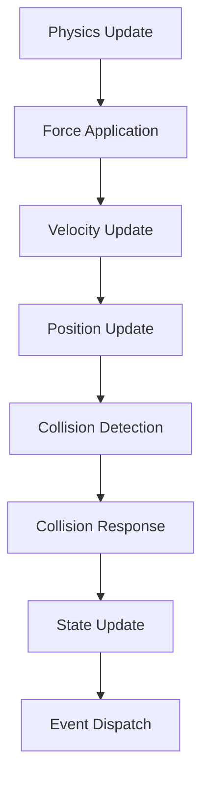
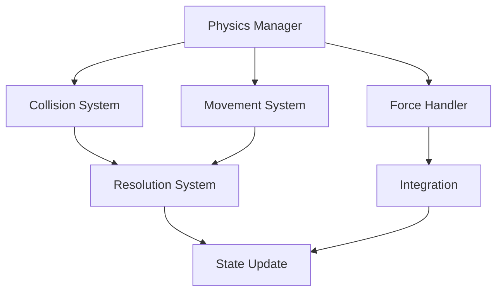

# Physics System Documentation

## Overview
The Physics system manages all physical interactions within the game world, handling collision detection, movement dynamics, environmental effects, and physical simulations while maintaining performance and gameplay balance.

## Core Systems

### Physics Architecture
- **System Types**
  - Collision Systems
    - Hitbox detection
    - Boundary checks
    - Intersection tests
    - Trigger volumes
    - Raycast systems
  
  - Movement Systems
    - Character movement
    - Object dynamics
    - Force application
    - Velocity control
    - Acceleration handling

### Physics Structure
```python
physics_data = {
    'object': {
        'id': entity_id,
        'type': physics_type,
        'mass': object_mass,
        'velocity': velocity_vector,
        'collider': collider_data
    },
    'properties': {
        'friction': friction_value,
        'restitution': bounce_factor,
        'gravity': gravity_scale,
        'drag': drag_coefficient,
        'constraints': movement_constraints
    },
    'collision': {
        'layer': collision_layer,
        'mask': collision_mask,
        'response': collision_response,
        'triggers': trigger_events,
        'callbacks': collision_callbacks
    }
}
```

## Physics Pipeline

### Simulation Loop


### Interaction Types
- **Physics Events**
  - Collisions
  - Triggers
  - Forces
  - Constraints
  - State changes

## Movement Systems

### Movement Types
- **Categories**
  - Character movement
  - Projectile motion
  - Rigid body dynamics
  - Soft body physics
  - Particle systems

### Force Management
- **Force Types**
  - Gravity
  - Impulse
  - Continuous force
  - Spring force
  - Area effect

## Technical Implementation

### Physics Pipeline


### Performance Systems
- **Optimization Methods**
  - Broad phase collision
  - Spatial partitioning
  - Sleep states
  - LOD physics
  - Batch processing

## Integration Points

### System Integration
- **Connected Systems**
  - Animation system
  - Combat system
  - Environment system
  - Character system
  - Effect system

### Event Handling
- **Event Types**
  - Collision events
  - Trigger events
  - Force events
  - State changes
  - Physics queries

## Collision System

### Collision Detection
- **Detection Types**
  - Primitive collisions
  - Mesh collisions
  - Trigger volumes
  - Raycasts
  - Sweeps

### Response System
- **Response Types**
  - Elastic collision
  - Inelastic collision
  - Trigger response
  - Custom response
  - Multi-collision

## Environmental Physics

### Environment Effects
- **Effect Types**
  - Wind forces
  - Water physics
  - Gravity fields
  - Pressure zones
  - Temperature effects

### Material System
- **Material Types**
  - Surface friction
  - Bounce factors
  - Density
  - Resistance
  - Special effects

## Development Tools

### Debug Tools
- **Tool Types**
  - Physics visualizer
  - Collision debugger
  - Force viewer
  - Performance profiler
  - State inspector

### Testing Framework
- **Test Categories**
  - Collision tests
  - Movement tests
  - Force tests
  - Performance tests
  - Integration tests

## Technical Considerations

### Performance Optimization
- **Optimization Areas**
  - Collision checks
  - Force calculations
  - Memory usage
  - CPU utilization
  - Update frequency

### Stability Management
- **Stability Types**
  - Numerical stability
  - Collision stability
  - Force stability
  - Integration stability
  - State consistency

## Error Handling

### Error Types
- **Error Categories**
  - Collision errors
  - Force errors
  - Integration errors
  - State errors
  - Performance errors

### Recovery Procedures
- **Recovery Steps**
  - Error detection
  - State correction
  - Force reset
  - Position correction
  - System reset

## Future Expansions

### Planned Features
- **Enhancements**
  - Better collisions
  - Advanced materials
  - Improved forces
  - More effects
  - Better tools

### System Improvements
- **Updates**
  - Higher accuracy
  - Better performance
  - More stability
  - Enhanced features
  - Better debugging