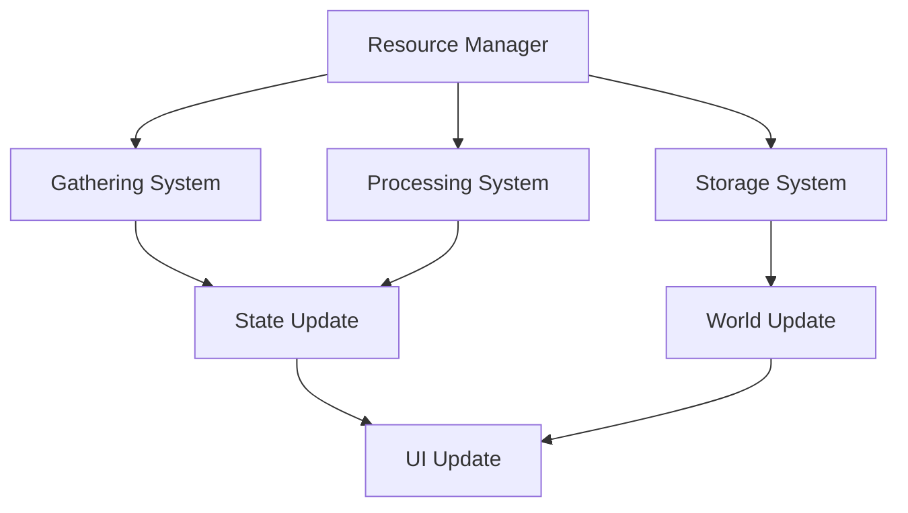
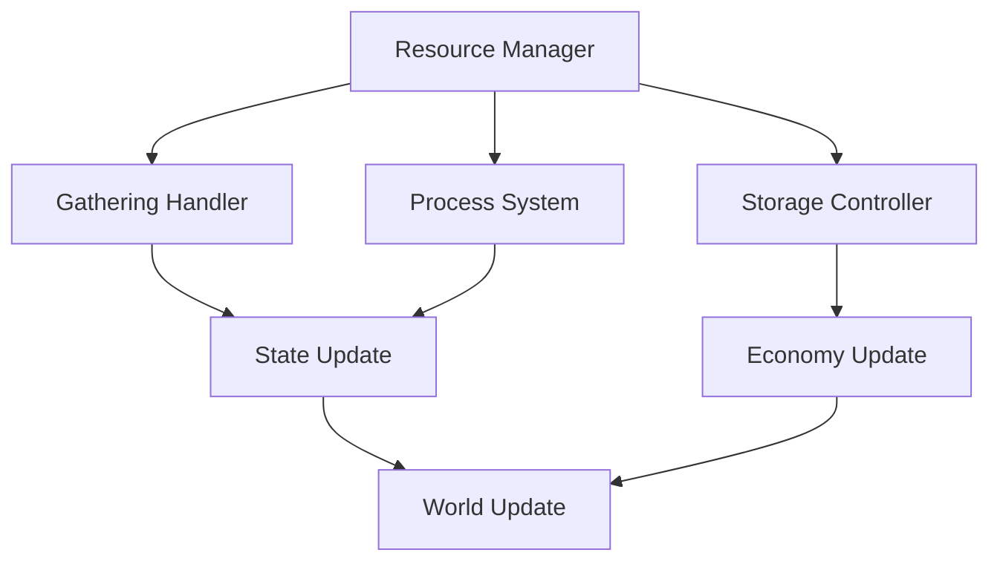

# Resource System Documentation

## Overview
The Resource system manages all aspects of game resources, including gathering, processing, storage, and consumption while providing meaningful economic depth and player progression through resource management.

## Core Systems

### Resource Architecture
- **Resource Types**
  - Physical materials
  - Magical essences
  - Energy types
  - Crafting materials
  - Special resources

### Resource Structure
```python
resource_data = {
    'base': {
        'id': resource_id,
        'type': resource_type,
        'rarity': rarity_level,
        'quality': quality_grade
    },
    'properties': {
        'value': base_value,
        'weight': item_weight,
        'stackable': stack_limit,
        'durability': decay_rate,
        'special': unique_props
    },
    'gathering': {
        'source': source_type,
        'method': gather_method,
        'tools': required_tools,
        'skills': needed_skills,
        'yield': resource_yield
    }
}
```

### Management Pipeline


## Gathering System

### Source Types
- **Source Categories**
  - Mining nodes
  - Harvesting points
  - Energy sources
  - Magical fonts
  - Special locations

### Gathering Methods
- **Method Types**
  - Mining
  - Harvesting
  - Extracting
  - Channeling
  - Special methods

## Processing System

### Processing Types
- **Process Categories**
  - Refinement
  - Conversion
  - Combination
  - Enhancement
  - Special processing

### Quality System
- **Quality Levels**
  - Raw
  - Refined
  - Pure
  - Perfect
  - Legendary

## Storage System

### Storage Types
- **Storage Categories**
  - Personal storage
  - Bank storage
  - Guild storage
  - Special storage
  - Dimensional storage

### Management Features
- **Feature Types**
  - Sorting
  - Stacking
  - Searching
  - Filtering
  - Auto-organization

## Technical Implementation

### System Pipeline


### Performance Systems
- **Optimization Methods**
  - Resource pooling
  - State caching
  - Load balancing
  - Data compression
  - Memory management

## Integration Points

### Connected Systems
- **System Links**
  - Crafting system
  - Economy system
  - Inventory system
  - Quest system
  - Achievement system

### Event Processing
- **Event Types**
  - Gathering events
  - Processing events
  - Storage events
  - Economy events
  - Special events

## Economy System

### Value System
- **Value Factors**
  - Base value
  - Quality modifier
  - Rarity factor
  - Market demand
  - Special properties

### Economic Controls
- **Control Types**
  - Price controls
  - Spawn rates
  - Yield rates
  - Quality rates
  - Special rates

## Development Tools

### Debug Tools
- **Tool Types**
  - Resource editor
  - Spawn manager
  - Process simulator
  - State inspector
  - Performance monitor

### Testing Framework
- **Test Categories**
  - Gathering tests
  - Processing tests
  - Storage tests
  - Integration tests
  - Performance tests

## Technical Considerations

### Performance Optimization
- **Optimization Areas**
  - Spawn handling
  - Process tracking
  - State updates
  - Storage access
  - Resource streaming

### Resource Management
- **Management Types**
  - Resource data
  - Node data
  - Process data
  - State data
  - Visual assets

## Future Expansions

### Planned Features
- **Enhancements**
  - New resources
  - Advanced processing
  - Better gathering
  - Enhanced storage
  - Special features

### System Improvements
- **Updates**
  - Better balance
  - Enhanced spawning
  - Smoother processing
  - Deeper integration
  - Advanced features 