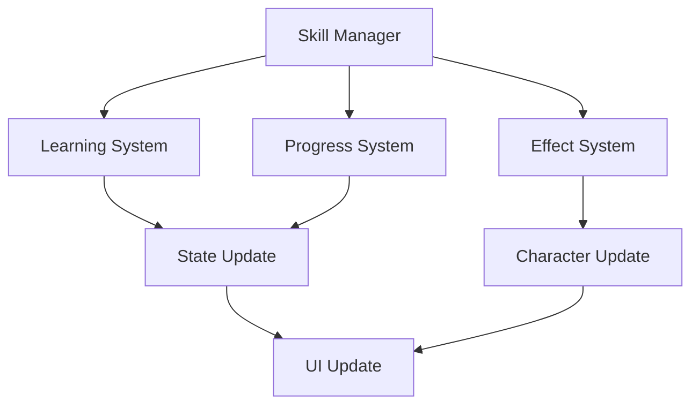
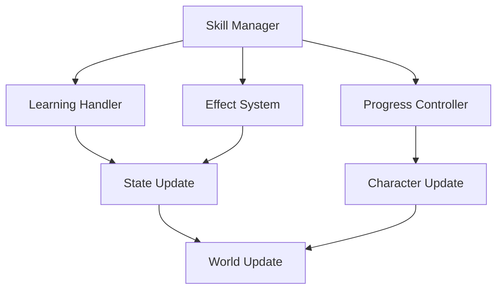

# Skill System Documentation

## Overview
The Skill system manages all aspects of character abilities and progression, including skill acquisition, development, specialization, and mastery while providing meaningful progression and strategic depth in character development.

## Core Systems

### Skill Architecture
- **Skill Types**
  - Combat skills
  - Magic abilities
  - Crafting skills
  - Social abilities
  - Utility skills

### Skill Structure
```python
skill_data = {
    'base': {
        'id': skill_id,
        'type': skill_type,
        'level': current_level,
        'experience': skill_exp
    },
    'attributes': {
        'power': base_power,
        'cost': resource_cost,
        'cooldown': use_cooldown,
        'requirements': skill_reqs,
        'modifiers': skill_mods
    },
    'progression': {
        'mastery': mastery_level,
        'talents': unlocked_talents,
        'specialization': spec_path,
        'achievements': skill_milestones,
        'bonuses': active_bonuses
    }
}
```

### Management Pipeline


## Learning System

### Skill Acquisition
- **Learning Methods**
  - Level-based
  - Quest rewards
  - Training
  - Discovery
  - Special events

### Progression Paths
- **Path Types**
  - Specialization trees
  - Mastery paths
  - Talent branches
  - Hybrid routes
  - Secret techniques

## Mastery System

### Mastery Levels
- **Level Types**
  - Novice
  - Adept
  - Expert
  - Master
  - Grandmaster

### Mastery Benefits
- **Benefit Types**
  - Power increase
  - Cost reduction
  - New effects
  - Special abilities
  - Unique modifiers

## Effect System

### Skill Effects
- **Effect Types**
  - Damage effects
  - Status effects
  - Utility effects
  - Area effects
  - Special effects

### Effect Modifiers
- **Modifier Types**
  - Power modifiers
  - Duration changes
  - Area adjustments
  - Cost alterations
  - Special modifiers

## Technical Implementation

### System Pipeline


### Performance Systems
- **Optimization Methods**
  - Effect pooling
  - State caching
  - Load balancing
  - Data compression
  - Resource management

## Integration Points

### Connected Systems
- **System Links**
  - Combat system
  - Magic system
  - Character system
  - Quest system
  - Achievement system

### Event Processing
- **Event Types**
  - Skill events
  - Learning events
  - Progress events
  - Effect events
  - Mastery events

## Balance System

### Power Scaling
- **Scale Factors**
  - Level scaling
  - Mastery impact
  - Equipment bonus
  - Status effects
  - Environmental factors

### Balance Controls
- **Control Types**
  - Power limits
  - Cost balancing
  - Cooldown management
  - Effect restrictions
  - Combo limits

## Development Tools

### Debug Tools
- **Tool Types**
  - Skill editor
  - Effect simulator
  - Progress tracker
  - State inspector
  - Performance monitor

### Testing Framework
- **Test Categories**
  - Skill tests
  - Effect tests
  - Progress tests
  - Integration tests
  - Performance tests

## Technical Considerations

### Performance Optimization
- **Optimization Areas**
  - Effect processing
  - State updates
  - Progress tracking
  - Visual effects
  - Sound processing

### Resource Management
- **Management Types**
  - Skill data
  - Effect data
  - Progress data
  - Visual assets
  - Sound effects

## Future Expansions

### Planned Features
- **Enhancements**
  - New skills
  - Advanced effects
  - Deep mastery
  - Better progression
  - Special abilities

### System Improvements
- **Updates**
  - Better balance
  - Enhanced effects
  - Smoother progression
  - Deeper integration
  - Advanced features 