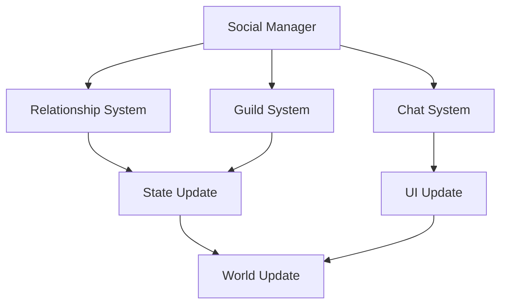
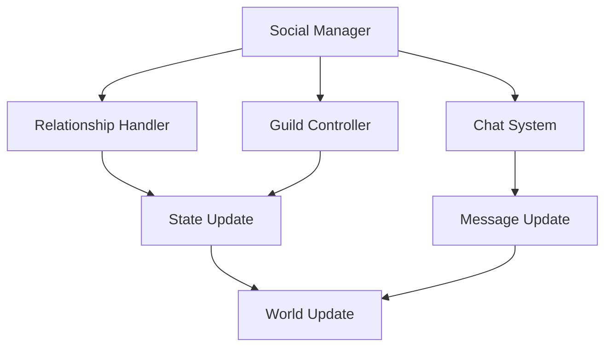

# Social System Documentation

## Overview
The Social system manages all aspects of player interactions, relationships, and community features, including friendships, guilds, chat systems, and social activities while fostering meaningful connections and collaborative gameplay experiences.

## Core Systems

### Social Architecture
- **Interaction Types**
  - Player relationships
  - Guild systems
  - Chat channels
  - Social activities
  - Community events

### Social Structure
```python
social_data = {
    'relationships': {
        'friends': friend_list,
        'guild': guild_data,
        'reputation': faction_standings,
        'blocks': blocked_users,
        'groups': social_circles
    },
    'communication': {
        'channels': active_channels,
        'messages': message_history,
        'notifications': alert_settings,
        'status': online_status,
        'emotes': available_emotes
    },
    'activities': {
        'events': current_events,
        'groups': party_data,
        'trades': trade_history,
        'interactions': social_actions,
        'achievements': social_milestones
    }
}
```

### Management Pipeline


## Relationship System

### Friend Management
- **Friend Features**
  - Friend lists
  - Status tracking
  - Activity sharing
  - Quick invites
  - Social feed

### Reputation System
- **Reputation Types**
  - Player reputation
  - Guild standing
  - Faction relations
  - Community status
  - Achievement rank

## Guild System

### Guild Features
- **Feature Types**
  - Guild hierarchy
  - Member management
  - Guild bank
  - Guild events
  - Guild achievements

### Guild Management
- **Management Tools**
  - Rank control
  - Resource sharing
  - Event planning
  - Member roles
  - Guild progression

## Communication System

### Chat Features
- **Channel Types**
  - Global chat
  - Guild chat
  - Party chat
  - Private messages
  - System announcements

### Message Management
- **Management Features**
  - Filter options
  - Chat history
  - Translation
  - Moderation tools
  - Notification settings

## Activity System

### Social Events
- **Event Types**
  - Guild events
  - Community gatherings
  - Group activities
  - Social challenges
  - Special celebrations

### Group Activities
- **Activity Types**
  - Group quests
  - Social minigames
  - Community projects
  - Guild missions
  - Special events

## Technical Implementation

### System Pipeline


### Performance Systems
- **Optimization Methods**
  - Message caching
  - State pooling
  - Load balancing
  - Data compression
  - Resource management

## Integration Points

### Connected Systems
- **System Links**
  - Player system
  - Quest system
  - Achievement system
  - Economy system
  - Housing system

### Event Processing
- **Event Types**
  - Social events
  - Guild events
  - Chat events
  - Relationship events
  - Activity events

## Moderation System

### Tools
- **Moderation Features**
  - Chat filters
  - Report system
  - Ban management
  - Warning system
  - Content control

### Safety Features
- **Protection Types**
  - Spam prevention
  - Harassment protection
  - Content filtering
  - Privacy controls
  - Account security

## Development Tools

### Debug Tools
- **Tool Types**
  - Social editor
  - Guild manager
  - Chat monitor
  - Event simulator
  - Performance tracker

### Testing Framework
- **Test Categories**
  - Chat tests
  - Guild tests
  - Event tests
  - Integration tests
  - Performance tests

## Technical Considerations

### Performance Optimization
- **Optimization Areas**
  - Message handling
  - State updates
  - Event processing
  - UI updates
  - Data synchronization

### Resource Management
- **Management Types**
  - Social data
  - Message data
  - Event data
  - UI resources
  - State data

## Future Expansions

### Planned Features
- **Enhancements**
  - Advanced guilds
  - Better chat
  - More activities
  - Enhanced social features
  - Deeper integration

### System Improvements
- **Updates**
  - Better performance
  - Enhanced moderation
  - Improved UI
  - Smoother integration
  - Advanced features 