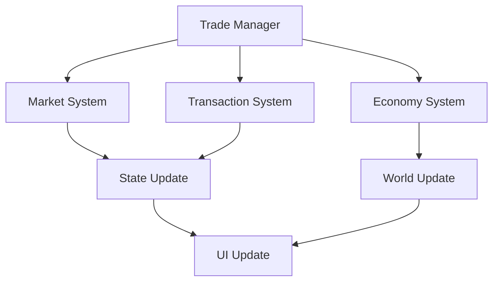
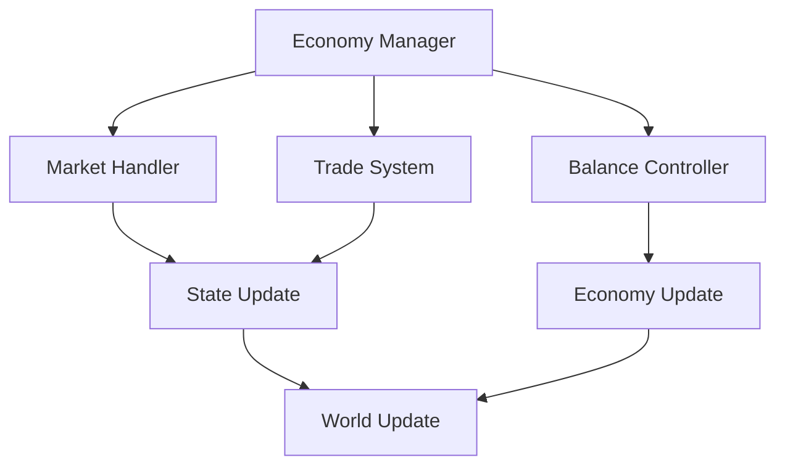

# Trading System Documentation

## Overview
The Trading system manages all aspects of economic exchanges and market interactions, including player trading, vendor systems, auction houses, and economic balance while providing meaningful commerce and player-driven economy.

## Core Systems

### Trading Architecture
- **Trade Types**
  - Player trading
  - Vendor systems
  - Auction houses
  - Market exchanges
  - Special trades

### Trading Structure
```python
trading_data = {
    'market': {
        'listings': active_listings,
        'history': trade_history,
        'trends': price_trends,
        'volume': trade_volume,
        'analytics': market_stats
    },
    'transactions': {
        'type': trade_type,
        'items': traded_items,
        'currency': payment_info,
        'status': trade_state,
        'verification': trade_checks
    },
    'economy': {
        'prices': current_prices,
        'demand': item_demand,
        'supply': item_supply,
        'modifiers': price_modifiers,
        'controls': economy_rules
    }
}
```

### Management Pipeline


## Market System

### Market Types
- **Exchange Categories**
  - Player markets
  - NPC vendors
  - Auction houses
  - Black markets
  - Special markets

### Market Features
- **Feature Types**
  - Price tracking
  - Supply/demand
  - Market trends
  - Trade history
  - Analytics

## Transaction System

### Trade Types
- **Transaction Categories**
  - Direct trades
  - Market sales
  - Auction bids
  - Vendor trades
  - Special deals

### Trade Processing
- **Process Steps**
  - Initiation
  - Verification
  - Execution
  - Confirmation
  - Recording

## Economy System

### Economic Features
- **Feature Types**
  - Price control
  - Currency management
  - Market balance
  - Trade limits
  - Economic events

### Balance Controls
- **Control Types**
  - Price floors
  - Price ceilings
  - Trade limits
  - Currency sinks
  - Market controls

## Technical Implementation

### System Pipeline


### Performance Systems
- **Optimization Methods**
  - Transaction pooling
  - State caching
  - Load balancing
  - Data compression
  - Resource management

## Integration Points

### Connected Systems
- **System Links**
  - Inventory system
  - Currency system
  - Quest system
  - Faction system
  - Achievement system

### Event Processing
- **Event Types**
  - Trade events
  - Market events
  - Economy events
  - Currency events
  - Special events

## Security System

### Trade Security
- **Security Features**
  - Trade validation
  - Anti-exploit
  - Value checks
  - Fraud prevention
  - Transaction logging

### Safety Measures
- **Protection Types**
  - Trade limits
  - Value caps
  - Rate limiting
  - Pattern detection
  - Rollback system

## Development Tools

### Debug Tools
- **Tool Types**
  - Market editor
  - Trade simulator
  - Economy monitor
  - State inspector
  - Performance tracker

### Testing Framework
- **Test Categories**
  - Trade tests
  - Market tests
  - Economy tests
  - Integration tests
  - Performance tests

## Technical Considerations

### Performance Optimization
- **Optimization Areas**
  - Transaction processing
  - Market updates
  - State management
  - Data synchronization
  - Resource handling

### Resource Management
- **Management Types**
  - Trade data
  - Market data
  - Economy data
  - State data
  - Analytics data

## Future Expansions

### Planned Features
- **Enhancements**
  - Advanced markets
  - Better trading
  - Deeper economy
  - Enhanced analytics
  - Special features

### System Improvements
- **Updates**
  - Better performance
  - Enhanced security
  - Improved UI
  - Deeper integration
  - Advanced features 