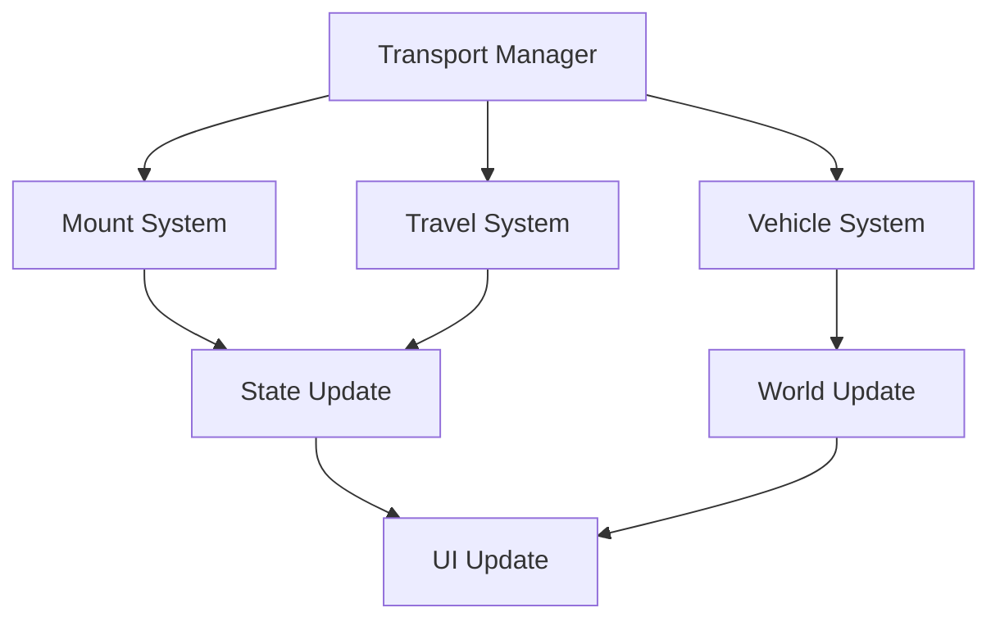
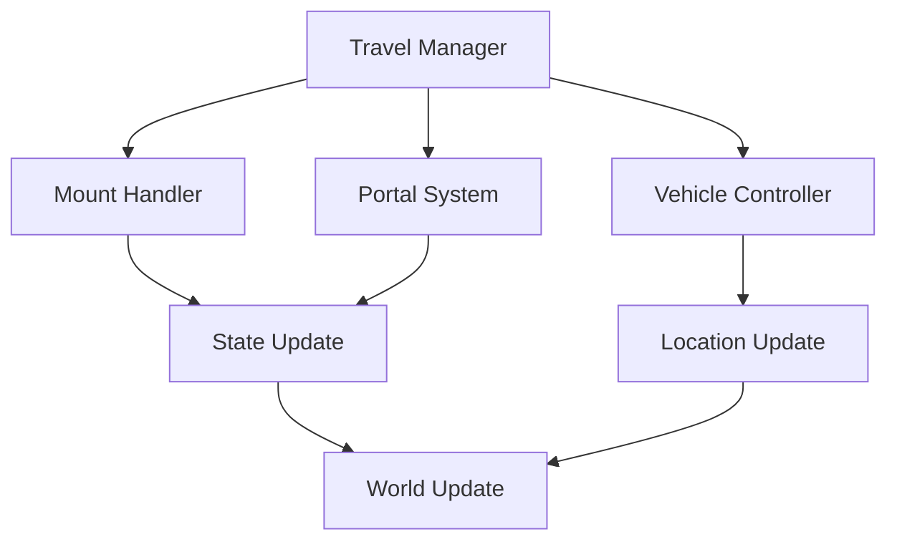

# Transportation System Documentation

## Overview
The Transportation system manages all aspects of player movement and travel, including mounts, portals, fast travel, and vehicles while providing seamless world traversal and meaningful travel experiences.

## Core Systems

### Transport Architecture
- **Travel Types**
  - Mount riding
  - Portal networks
  - Fast travel points
  - Vehicle operation
  - Dimensional gates

### Transport Structure
```python
transport_data = {
    'mounts': {
        'active': current_mount,
        'available': owned_mounts,
        'stats': mount_attributes,
        'customization': mount_appearance,
        'abilities': mount_skills
    },
    'fast_travel': {
        'points': discovered_locations,
        'cooldowns': travel_timers,
        'costs': travel_expenses,
        'restrictions': travel_limits,
        'favorites': preferred_points
    },
    'vehicles': {
        'type': vehicle_class,
        'status': vehicle_condition,
        'fuel': energy_level,
        'upgrades': installed_mods,
        'cargo': storage_space
    }
}
```

### Management Pipeline


## Mount System

### Mount Types
- **Mount Categories**
  - Ground mounts
  - Flying mounts
  - Aquatic mounts
  - Combat mounts
  - Special mounts

### Mount Features
- **Feature Types**
  - Speed bonuses
  - Special abilities
  - Combat capabilities
  - Customization options
  - Training progression

## Fast Travel System

### Travel Points
- **Point Types**
  - Cities and towns
  - Outposts
  - Sanctuaries
  - Faction bases
  - Special locations

### Travel Mechanics
- **Mechanic Types**
  - Cost calculation
  - Cooldown timers
  - Restrictions
  - Requirements
  - Unlocking methods

## Vehicle System

### Vehicle Types
- **Categories**
  - Land vehicles
  - Air vehicles
  - Water vessels
  - Dimensional craft
  - Special vehicles

### Vehicle Features
- **Feature Types**
  - Speed control
  - Fuel management
  - Cargo space
  - Upgrades
  - Maintenance

## Portal Network

### Portal Types
- **Network Categories**
  - City portals
  - Faction gates
  - Dimensional rifts
  - Emergency exits
  - Special portals

### Portal Mechanics
- **Mechanic Types**
  - Activation costs
  - Cooldown periods
  - Access rights
  - Stability factors
  - Connection strength

## Technical Implementation

### System Pipeline


### Performance Systems
- **Optimization Methods**
  - Location caching
  - Path optimization
  - State pooling
  - Load balancing
  - Resource management

## Integration Points

### Connected Systems
- **System Links**
  - World system
  - Combat system
  - Quest system
  - Economy system
  - Achievement system

### Event Processing
- **Event Types**
  - Travel events
  - Mount events
  - Vehicle events
  - Portal events
  - Location events

## Customization System

### Mount Customization
- **Customization Options**
  - Appearance
  - Equipment
  - Skills
  - Effects
  - Accessories

### Vehicle Customization
- **Modification Types**
  - Performance upgrades
  - Visual modifications
  - Utility additions
  - Special features
  - Color schemes

## Development Tools

### Debug Tools
- **Tool Types**
  - Transport editor
  - Location manager
  - Path simulator
  - State inspector
  - Performance monitor

### Testing Framework
- **Test Categories**
  - Mount tests
  - Travel tests
  - Vehicle tests
  - Integration tests
  - Performance tests

## Technical Considerations

### Performance Optimization
- **Optimization Areas**
  - Path finding
  - State updates
  - Location loading
  - Travel transitions
  - Resource streaming

### Resource Management
- **Management Types**
  - Transport data
  - Location data
  - State data
  - Visual assets
  - Sound effects

## Future Expansions

### Planned Features
- **Enhancements**
  - New mounts
  - Advanced vehicles
  - Better portals
  - Enhanced travel
  - Special transport

### System Improvements
- **Updates**
  - Better pathfinding
  - Smoother transitions
  - Enhanced visuals
  - Deeper integration
  - Advanced features 