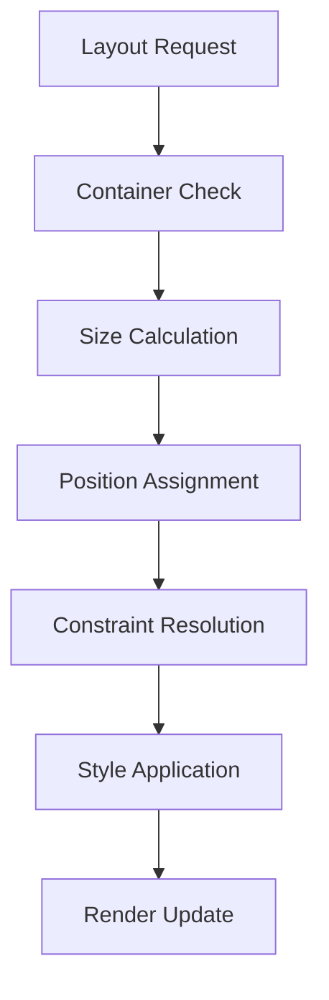
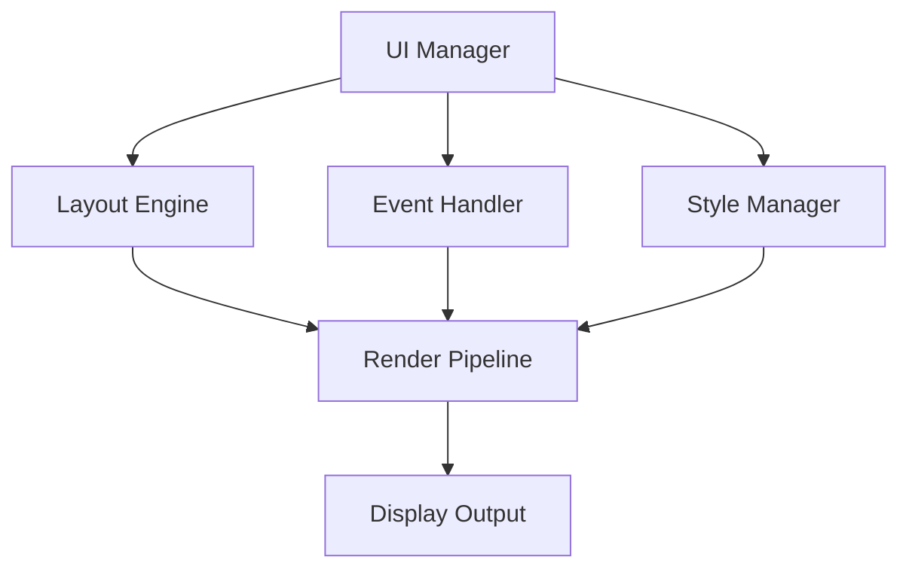

# UI/UX Framework Documentation

## Overview
The UI/UX Framework manages all aspects of user interface and experience, providing a robust, scalable, and accessible system for player interaction while maintaining consistent design language and optimal performance.

## Core Systems

### UI Architecture
- **Component Types**
  - Core Components
    - Windows
    - Panels
    - Buttons
    - Input fields
    - Lists
  
  - Game-Specific Components
    - Character panels
    - Inventory grids
    - Quest logs
    - Combat UI
    - Dialog systems

### Component Structure
```python
ui_component = {
    'metadata': {
        'id': component_id,
        'type': component_type,
        'parent': parent_id,
        'layer': layer_order,
        'state': current_state
    },
    'properties': {
        'position': position_data,
        'size': size_data,
        'style': style_properties,
        'animation': animation_data,
        'interaction': interaction_rules
    },
    'content': {
        'text': text_content,
        'images': image_resources,
        'localization': language_keys,
        'dynamic_data': data_bindings,
        'templates': template_refs
    }
}
```

## Layout System

### Layout Management


### Responsive Design
- **Adaptation Methods**
  - Grid systems
  - Flex layouts
  - Dynamic scaling
  - Breakpoints
  - Content flow

## Interaction System

### Input Handling
- **Input Types**
  - Mouse/Touch
  - Keyboard
  - Gamepad
  - Voice
  - Accessibility devices

### Event System
- **Event Categories**
  - User inputs
  - State changes
  - Data updates
  - Animations
  - Focus management

## Technical Implementation

### UI Pipeline


### Performance Systems
- **Optimization Methods**
  - Component pooling
  - Lazy loading
  - Virtual scrolling
  - Batch rendering
  - State caching

## Style System

### Theme Management
- **Theme Components**
  - Color schemes
  - Typography
  - Spacing rules
  - Animations
  - Effects

### Style Inheritance
- **Inheritance Chain**
  - Global styles
  - Theme variants
  - Component styles
  - State styles
  - Instance styles

## Accessibility Features

### Core Accessibility
- **Feature Types**
  - Screen readers
  - Keyboard navigation
  - Color contrast
  - Text scaling
  - Focus indicators

### Adaptation Options
- **Customization**
  - Text size
  - Color modes
  - Input methods
  - Audio cues
  - Motion reduction

## Integration Points

### System Integration
- **Connected Systems**
  - Game state
  - Audio system
  - Input system
  - Localization
  - Animation system

### Data Binding
- **Binding Types**
  - One-way binding
  - Two-way binding
  - Event binding
  - Collection binding
  - Template binding

## Animation System

### Animation Types
- **Categories**
  - Transitions
  - State changes
  - Feedback effects
  - Loading states
  - Attention guides

### Animation Pipeline
- **Processing Steps**
  - Animation queue
  - Priority handling
  - State tracking
  - Performance monitoring
  - Cleanup

## Development Tools

### Debug Tools
- **Tool Types**
  - Layout inspector
  - Event monitor
  - Style debugger
  - Performance profiler
  - Accessibility checker

### Testing Framework
- **Test Categories**
  - Unit tests
  - Integration tests
  - Visual regression
  - Performance tests
  - Accessibility tests

## Technical Considerations

### Performance Optimization
- **Optimization Areas**
  - Render efficiency
  - Memory usage
  - Event handling
  - Layout calculations
  - Asset loading

### State Management
- **State Types**
  - Component state
  - Layout state
  - Input state
  - Animation state
  - Focus state

## Error Handling

### Error Types
- **Error Categories**
  - Layout errors
  - Event errors
  - Resource errors
  - State errors
  - Render errors

### Recovery Procedures
- **Recovery Steps**
  - Error detection
  - State recovery
  - UI reset
  - Resource reload
  - User notification

## Future Expansions

### Planned Features
- **Enhancements**
  - Advanced animations
  - Better accessibility
  - More components
  - Enhanced themes
  - Better tools

### System Improvements
- **Updates**
  - Performance boost
  - Memory optimization
  - Better scaling
  - More customization
  - Enhanced debugging 