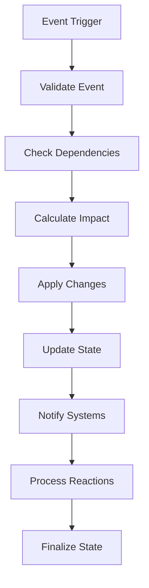
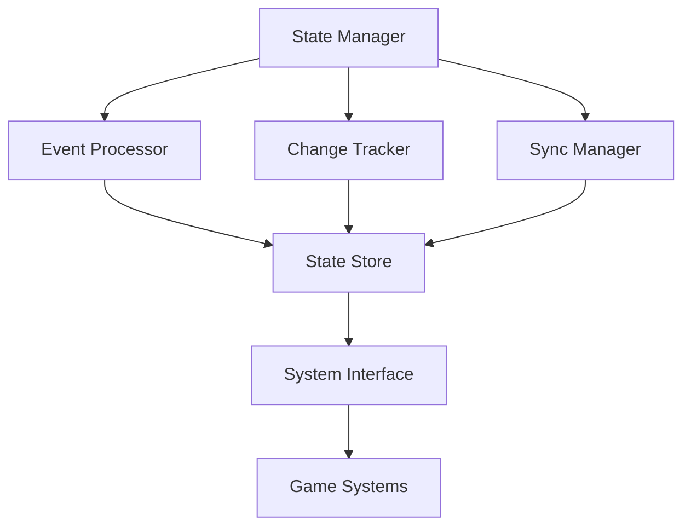

# World State Management Subsystem Documentation

## Overview
The World State Management subsystem is the central nervous system of Elysian Nexus, managing persistent state, event processing, and synchronization across all game systems.

## Core Systems

### State Management
- **State Categories**
  - World State
    - Time and weather
    - Realm conditions
    - Global events
    - World progression
  
  - Entity States
    - NPCs
    - Factions
    - Resources
    - Structures
    - Portals

  - Player States
    - Character data
    - Inventory
    - Relationships
    - Achievements
    - Quest progress

## State Persistence

### Data Structure
```python
world_state = {
    'global': {
        'time': current_time,
        'weather': weather_conditions,
        'events': active_events,
        'stability': realm_stability
    },
    'regions': {
        'region_id': {
            'control': faction_control,
            'resources': available_resources,
            'npcs': present_entities,
            'conditions': local_effects
        }
    },
    'entities': {
        'entity_id': {
            'state': current_state,
            'location': position_data,
            'relations': relationship_data,
            'inventory': possessed_items
        }
    }
}
```

### State Operations
- **Core Operations**
  - State Reading
  - State Writing
  - State Validation
  - State Rollback
  - State Recovery

## Event Processing

### Event Pipeline


### Event Types
- **System Events**
  - Time Changes
  - Weather Updates
  - Faction Actions
  - Resource Changes
  - Portal Activities

### Event Handlers
- **Handler Types**
  - State Updaters
  - System Notifiers
  - Chain Processors
  - Error Handlers
  - Recovery Managers

## State Synchronization

### Sync Mechanisms
- **Sync Types**
  - Full Sync
  - Delta Updates
  - Partial Sync
  - Priority Sync
  - Emergency Sync

### System Integration
- **Connected Systems**
  - Combat System
  - Quest System
  - Faction System
  - Economy System
  - Weather System

## Change Management

### Change Tracking
- **Track Types**
  - State Changes
  - Event History
  - Action Log
  - Error Log
  - Recovery Points

### Change Validation
- **Validation Types**
  - State Integrity
  - Data Consistency
  - Relationship Validity
  - Resource Balance
  - Event Sequence

## Technical Implementation

### Architecture


### Performance Systems
- **Optimization Methods**
  - State Caching
  - Event Batching
  - Delta Compression
  - Priority Queue
  - Lazy Loading

## Integration Points

### System Connections
- **Connected Systems**
  - Combat Manager
  - Quest Handler
  - Faction Controller
  - Resource Manager
  - Player System

### Data Flow
- **Flow Types**
  - State Updates
  - Event Propagation
  - System Notifications
  - Error Reports
  - Recovery Signals

## Error Handling

### Error Types
- **Error Categories**
  - State Corruption
  - Sync Failure
  - Event Collision
  - Data Inconsistency
  - System Conflict

### Recovery Procedures
- **Recovery Types**
  - State Restore
  - Event Replay
  - Data Rebuild
  - System Reset
  - Partial Recovery

## Monitoring Systems

### State Monitoring
- **Monitor Types**
  - Performance Metrics
  - State Integrity
  - Event Processing
  - System Health
  - Error Rates

### Analysis Tools
- **Tool Types**
  - State Analyzer
  - Event Debugger
  - Performance Profiler
  - Error Tracker
  - Load Monitor

## Technical Considerations

### State Management
- **Management Types**
  - Memory Usage
  - Processing Load
  - Storage Efficiency
  - Network Load
  - System Response

### Optimization
- **Optimization Areas**
  - State Access
  - Event Processing
  - Change Tracking
  - Sync Operations
  - Error Handling

## Future Expansions

### Planned Features
- **Enhancements**
  - Advanced state tracking
  - Complex event chains
  - Improved recovery
  - Better synchronization
  - Enhanced monitoring

### System Improvements
- **Updates**
  - Performance optimization
  - Error prevention
  - System integration
  - Data management
  - Tool enhancement 