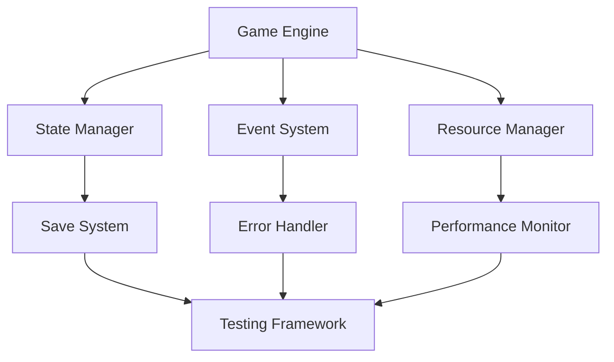

# Technical Systems and Architecture Documentation

## Overview
This document details the technical architecture and systems that power Elysian Nexus, including performance optimization, state management, and system integration.

## Table of Contents
1. [Architecture Overview](#architecture-overview)
2. [State Management](#state-management)
3. [Performance Systems](#performance-systems)
4. [Save System](#save-system)
5. [Error Handling](#error-handling)
6. [Testing Framework](#testing-framework)

## Architecture Overview
### System Structure
- **Core Systems**
  - Game Engine
  - State Manager
  - Event System
  - Resource Manager
  - Input Handler
  - Render System

### Integration Points
- System communication
- Data flow
- Event handling
- State synchronization
- Resource sharing

### Design Patterns
- Observer pattern
- State pattern
- Factory pattern
- Command pattern
- Singleton pattern

## State Management
### Overview
Comprehensive state management system handling game state and persistence.

### Core Components
- **State Types**
  - Game state
  - Player state
  - World state
  - UI state
  - System state

### State Operations
- State initialization
- State updates
- State validation
- State persistence
- State recovery

### State Synchronization
- Multi-system sync
- State versioning
- Conflict resolution
- Data integrity
- Recovery procedures

## Performance Systems
### Overview
Systems ensuring optimal game performance and resource utilization.

### Monitoring Systems
- **Performance Metrics**
  - CPU usage
  - Memory usage
  - State size
  - Update time
  - Render time

### Optimization
- Resource pooling
- Memory management
- State caching
- Lazy loading
- Batch processing

### Profiling Tools
- Performance tracking
- Bottleneck detection
- Resource monitoring
- System analysis
- Optimization suggestions

## Save System
### Overview
Robust save system managing game state persistence and recovery.

### Save Components
- **Save Data**
  - Player data
  - World state
  - Quest progress
  - Inventory data
  - System state

### Save Operations
- Auto-saving
- Manual saves
- Save validation
- Data compression
- Error recovery

### Save Features
- Multiple slots
- Save metadata
- Version control
- Data migration
- Backup system

## Error Handling
### Overview
Comprehensive error handling and recovery system.

### Error Types
- **System Errors**
  - State errors
  - Runtime errors
  - Logic errors
  - Resource errors
  - Input errors

### Error Handling
- Error detection
- Error logging
- Error recovery
- User notification
- System restoration

### Recovery Procedures
- State recovery
- Data validation
- System restart
- Resource cleanup
- User feedback

## Testing Framework
### Overview
Comprehensive testing system ensuring game stability and functionality.

### Test Types
- **Unit Tests**
  - System tests
  - Integration tests
  - Performance tests
  - State tests
  - UI tests

### Test Components
- Test runners
- Test suites
- Assertions
- Mocking
- Coverage analysis

### Test Automation
- CI/CD integration
- Automated testing
- Performance testing
- Regression testing
- Load testing

## Technical Implementation
### System Architecture

### Performance Optimization
- **Optimization Strategies**
  - Code optimization
  - Resource management
  - State optimization
  - Memory management
  - Cache utilization

### System Integration
- Inter-system communication
- Data flow management
- Event propagation
- State synchronization
- Resource sharing

## Future Improvements
### Planned Features
- Enhanced error handling
- Advanced testing
- Better performance
- Improved saves
- System monitoring

### Technical Debt
- Code refactoring
- Documentation updates
- Test coverage
- Performance optimization
- Architecture improvements 