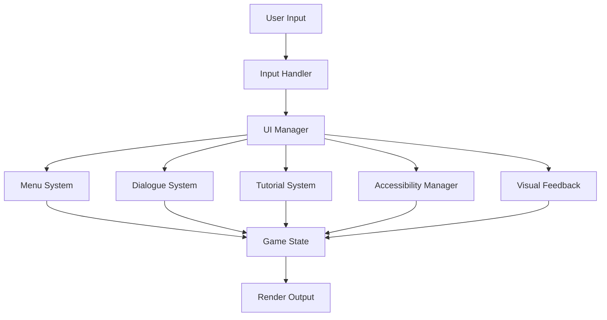

# UI and Interaction Systems Documentation

## Overview
This document details the user interface and interaction systems of Elysian Nexus, covering both visual and mechanical aspects of player interaction.

## Table of Contents
1. [UI System](#ui-system)
2. [Menu System](#menu-system)
3. [Dialogue System](#dialogue-system)
4. [Tutorial System](#tutorial-system)
5. [Accessibility Features](#accessibility-features)
6. [Visual Feedback System](#visual-feedback-system)

## UI System
### Overview
The UI system provides a comprehensive interface for player interaction with game systems.

### Core Components
- **Main Interface Elements**
  - Status displays
  - Inventory management
  - Quest tracking
  - Map interface
  - Combat UI
  - Faction status

### Visual Styling
- ASCII art integration
- Color coding system
- Dynamic UI scaling
- Theme customization
- Faction-specific styling

### Interaction Methods
- Keyboard controls
- Command input
- Menu navigation
- Shortcut systems
- Context-sensitive actions

## Menu System
### Overview
A hierarchical menu system providing access to all game features and settings.

### Core Components
- **Menu Types**
  - Main menu
  - Game menu
  - Inventory menu
  - Character menu
  - System menu
  - Faction menu

### Navigation Features
- Breadcrumb navigation
- Quick access shortcuts
- Context-sensitive options
- Search functionality
- Recent actions

### Customization Options
- Menu layout
- Keybinding configuration
- Display preferences
- Accessibility settings
- UI scaling

## Dialogue System
### Overview
Manages character interactions and narrative delivery through a sophisticated dialogue engine.

### Core Components
- **Dialogue Types**
  - NPC conversations
  - Faction interactions
  - Quest dialogues
  - Tutorial guidance
  - System messages

### Dialogue Features
- Branching conversations
- Reputation influence
- Faction relationships
- Dynamic responses
- Context awareness

### Integration Points
- Quest system
- Faction system
- Tutorial system
- Character development
- Story progression

## Tutorial System
### Overview
A comprehensive learning system that guides players through game mechanics and features.

### Core Components
- **Tutorial Types**
  - Basic mechanics
  - Advanced features
  - Faction interactions
  - Combat training
  - Economic tutorials

### Learning Progression
- Staged introduction
- Interactive lessons
- Practical exercises
- Knowledge checks
- Advanced tutorials

### Customization
- Skill level adaptation
- Optional tutorials
- Quick references
- Help system
- Tutorial replay

## Accessibility Features
### Overview
Comprehensive accessibility options ensuring the game is playable by users with different needs.

### Core Features
- **Visual Accessibility**
  - High contrast modes
  - Text scaling
  - Color blind options
  - Screen reader support
  - Custom formatting

### Input Accessibility
- Keyboard remapping
- Input timing adjustments
- Alternative controls
- Macro support
- Auto-complete features

### Audio Accessibility
- Volume controls
- Sound alternatives
- Text descriptions
- Audio cues
- Customizable alerts

## Visual Feedback System
### Overview
Provides clear visual feedback for player actions and game events.

### Core Components
- **Feedback Types**
  - Action confirmation
  - Error messages
  - Status updates
  - Achievement notices
  - System alerts

### Visual Elements
- ASCII art integration
- Color coding
- Animation effects
- Status indicators
- Progress displays

### Integration Points
- Combat system
- Faction system
- Economic system
- Quest system
- Achievement system

## Technical Implementation
### Architecture

### Performance Optimization
- Efficient rendering
- Input buffering
- State caching
- Lazy loading
- Memory management

### Future Enhancements
- Advanced UI customization
- Enhanced accessibility
- Improved visual feedback
- Extended tutorial system
- Additional language support 