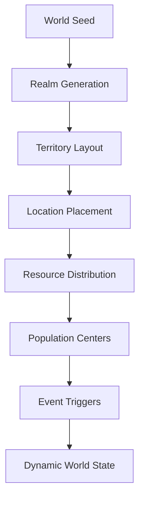

# World and Environment Systems Documentation

## Overview
This document details the world-building and environmental systems that create the rich, dynamic universe of Elysian Nexus.

## Table of Contents
1. [World Structure](#world-structure)
2. [Environment System](#environment-system)
3. [Exploration System](#exploration-system)
4. [Territory System](#territory-system)
5. [Travel System](#travel-system)
6. [World Events](#world-events)

## World Structure
### Overview
The fundamental organization and hierarchy of the game world.

### Realms
- **Primary Realms**
  - Material Plane
  - Celestial Realm
  - Void Dimension
  - Time Nexus
  - Reality Fold
  - Essence Plane
  - Chaos Realm
  - Order Domain

### Locations
- **Location Types**
  - Major cities
  - Faction strongholds
  - Wilderness areas
  - Sacred sites
  - Trading hubs
  - Hidden realms

### World Scale
- Realm boundaries
- Territory sizes
- Travel distances
- Population centers
- Resource distribution

## Environment System
### Overview
Dynamic environmental systems that affect gameplay and world interaction.

### Environmental Factors
- **Weather Systems**
  - Climate patterns
  - Magical weather
  - Realm-specific conditions
  - Environmental hazards

### Time System
- Day/night cycle
- Seasonal changes
- Temporal anomalies
- Event timing
- Activity schedules

### Atmosphere
- Realm ambiance
- Weather effects
- Lighting conditions
- Sound environment
- Special effects

## Exploration System
### Overview
Systems governing world discovery and interaction.

### Exploration Mechanics
- **Discovery Types**
  - Location finding
  - Secret areas
  - Hidden paths
  - Resource spots
  - Lore objects

### Rewards
- Experience gains
- Item discoveries
- Knowledge acquisition
- Faction influence
- Special encounters

### Challenges
- Environmental hazards
- Enemy encounters
- Navigation puzzles
- Resource management
- Time constraints

## Territory System
### Overview
Management of world territories and their control.

### Territory Types
- **Control Zones**
  - Faction territories
  - Contested areas
  - Neutral zones
  - Sacred grounds
  - Wild lands

### Control Mechanics
- Territory influence
- Resource control
- Population management
- Defense systems
- Development options

### Territory Features
- Strategic points
- Resource nodes
- Population centers
- Military positions
- Trade routes

## Travel System
### Overview
Systems managing movement between locations and realms.

### Travel Methods
- **Standard Travel**
  - Walking/Running
  - Mount riding
  - Vehicle use
  - Ship travel
  - Caravan routes

### Special Transportation
- Teleportation
- Portal networks
- Realm gates
- Time paths
- Void walking

### Travel Features
- Distance calculation
- Time requirements
- Resource costs
- Risk assessment
- Path finding

## World Events
### Overview
Dynamic events that shape and change the game world.

### Event Types
- **Major Events**
  - Realm conflicts
  - Natural disasters
  - Faction wars
  - Divine interventions
  - World changes

### Random Events
- Weather phenomena
- Resource discoveries
- Monster migrations
- Trade opportunities
- Local incidents

### Event Impact
- Territory changes
- Resource availability
- Population effects
- Economic impact
- Political shifts

## Technical Implementation
### World Generation

### State Management
- World state tracking
- Environmental updates
- Territory control
- Event processing
- Travel calculations

### Performance Optimization
- World streaming
- State caching
- Event queuing
- Location loading
- Resource management

## Future Expansions
### Planned Features
- New realms
- Advanced weather
- Complex territories
- Travel methods
- Event types

### System Improvements
- Enhanced generation
- Better pathfinding
- Improved events
- Territory mechanics
- Travel options 